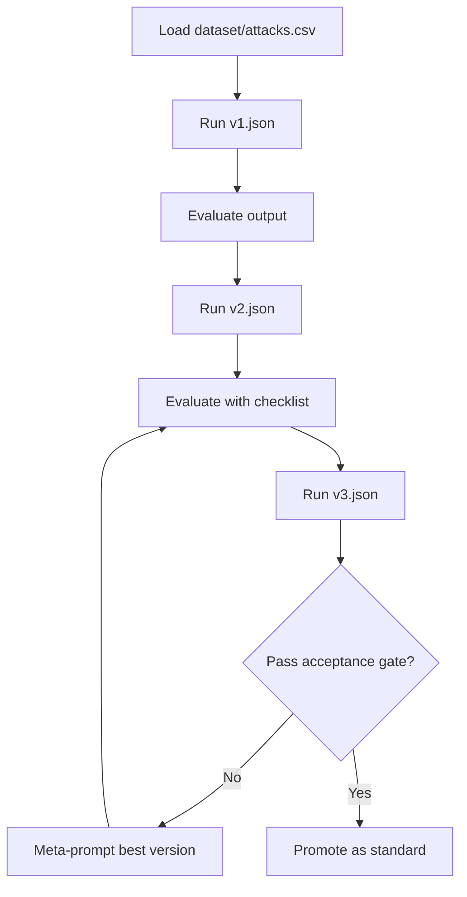

# Prompt Engineering Practice

This repository practices **ReAct-style prompt design** for reliable analysis of `dataset/attacks.csv`. The goal is **evidence-grounded** answers with **explicit uncertainty**, **confidence labels**, and a **stable output shape** so runs are comparable.

---

## How prompts run

- Prompts live in [`prompts/`](prompts/) as **`v1.json`**, **`v2.json`**, **`v3.json`** (processed in **file-name order**).
- Each file defines two string arrays: `DefaultAssistantRole` (system) and `DefaultUserPrompt` (user). The client **joins array entries with newlines** into the messages sent to the model.
- The user prompt must contain a `<data>...</data>` region. At runtime, the app **replaces the inner part** with one `<record>...</record>` per loaded CSV row (see [Injected XML](#injected-xml-one-record-per-row)).
- Paths for prompts, dataset, and output are configured under `ContextSettings` in [`src/PromptEngineering.Client/appsettings.json`](src/PromptEngineering.Client/appsettings.json).
- When every prompt file has finished, [`IContextService.SummarizeAsync`](src/PromptEngineering.Services/IContextService.cs) (see [`ContextService`](src/PromptEngineering.Services/ContextService.cs)) writes a default **`results.txt`** (cwd-relative path unless overridden): for each run, a compact header (`## Run: {prompt stem}` and `Output: {path}`) followed by verbatim first-choice assistant text; runs are separated by a `---` block. Empty completions use an explicit placeholder referencing the output path. This is **host-side formatting only**—no second LLM call—so you can compare v1/v2/v3 side by side.

---

## Injected XML (one record per row)

The pipeline maps selected CSV columns into XML tags (names are fixed; empty tags mean missing values in the source row).

| XML element | Source column (conceptual) |
|-------------|----------------------------|
| `Year` | Year |
| `Country` | Country |
| `Area` | Area |
| `Type` | Type |
| `Activity` | Activity |
| `Injury` | Injury |
| `FatalYN` | Fatal (Y/N) |
| `Sex` | Sex (CSV header may include a trailing space) |
| `Age` | Age |
| `Time` | Time |
| `Species` | Species (CSV header may include a trailing space) |
| `InvestigatorSource` | Investigator or Source |

The raw CSV has additional columns (e.g. Case Number, Date, links). They are **not** injected unless the loader is extended; analyses should rely on the elements above.

---

## ReAct prompt standard (repository rule)

### Canonical ReAct (Reasoning + Acting)

In the general pattern, the model repeats a loop until it can answer:

1. **Thought** — Analyze the situation, decompose the problem, plan the next step.
2. **Action** — Choose and execute a tool (for example `Search[query]`, `Calculator[expression]`, or an API call).
3. **Observation** — The environment returns tool output; the model uses it in the next Thought.

**Prompt ingredients** for agentic ReAct: **system instructions** that require Thought/Action/Observation formatting, **defined tools**, and often **few-shot** examples of correct tool use.

Compared with linear chain-of-thought, ReAct is **adaptive** (the path changes from observations), encourages **stepwise** answers, and can ground claims in **external** knowledge when real tools are wired in.

### ReAct in this repository

The client sends **one** system message plus **one** user message (with injected `<data>`) and receives **one** completion ([`ContextService`](src/PromptEngineering.Services/ContextService.cs)). There is **no** host-driven multi-turn tool loop.

Here, **Observation** means what the model **reads** from `<record>` elements (patterns, gaps, contradictions)—not a separate HTTP round-trip. **Action** means deliberate **analytical moves** on that evidence (for example stratifying by `Country` and `FatalYN`, scanning missingness)—carried out in the model’s **internal** reasoning, not executed by the app. **v3** requires that internal Thought/Action/Observation cycle before the visible Sections A–D; the final reply does **not** include a separate trace section.

**Illustrative single cycle** (format only; not a second API call):

- **Thought:** I need Activity and Type vs outcomes before writing Section A bullets.
- **Action:** `ReviewElements[Activity, Type, FatalYN, Injury]` — scan `<record>` values and missing tags.
- **Observation:** Several activities recur; `Type` mixes Unprovoked, Provoked, Invalid; `Injury` is heterogeneous text—claims should be qualified.

Production-ready prompts here should also enforce:

1. **Role first** — domain-relevant analyst, not a generic assistant.
2. **Explicit scope** — which fields and the research question (see below).
3. **ReAct flow** — field selection → data-quality check → evidence-based findings → **self-critique** → **claim revision** before the final answer (mapped to Thought/Action/Observation internally in **v3**; see [.cursor/rules/project-rules.mdc](.cursor/rules/project-rules.mdc)).
4. **Strict response schema** — section headings and **bullet limits** (see **v3**).
5. **Safety** — no fabricated metrics; disclose partial evidence; **High / Medium / Low** confidence on substantive claims.

---

## Research question (shared across v1–v3)

All three prompt versions target one thread:

**Question:** In the provided `<record>` rows from `dataset/attacks.csv`, how do **Activity** and encounter **Type** relate to harm outcomes (**FatalYN** and **Injury**), and which **data-quality** issues most limit how strong those conclusions can be?

**Primary elements:** Type, Activity, Injury, FatalYN. **Context as needed:** Year, Country, Area (and other injected elements only for supporting detail).

---

## Prompt progression (v1 → v2 → v3)

| Version | File | Intent | ReAct |
|---------|------|--------|--------|
| **v1** | [`prompts/v1.json`](prompts/v1.json) | Baseline: same research question, minimal scaffolding; internal analytical flow; points to v3 for strict ReAct | Implicit only (no mandatory Thought/Action/Observation or 5-step loop; still cite `<record>` evidence) |
| **v2** | [`prompts/v2.json`](prompts/v2.json) | **Numbered outcomes**, field focus, fixed **section headings**, confidence on substantive bullets | Implicit structured reasoning (quality + follow-ups explicit; no mandatory ToA vocabulary or 5-step loop) |
| **v3** | [`prompts/v3.json`](prompts/v3.json) | **Canonical**: mandatory internal **Thought/Action/Observation** on `<record>` data plus 5-step self-reflection; **strict** Sections A–D and bullet caps | **Mandatory** (internal ToA + steps; visible output remains A–D only) |

**Gaps each step fixes:** v1 → v2 adds structure and confidence discipline; v2 → v3 adds mandatory self-critique, claim revision, and a rigid schema for cross-run comparison.

---

## v3 output schema (canonical)

Section titles and limits match [`prompts/v3.json`](prompts/v3.json):

- **Section A — Findings:** 3–5 bullets (insight; supporting elements; Confidence: High | Medium | Low).
- **Section B — Data quality caveats:** 3–5 bullets (each ties a risk to interpretation).
- **Section C — Next analyses:** at most 3 bullets (feasible on the same fields).
- **Section D — Executive summary:** at most 3 short bullets; no new unsupported claims.

---

## Workflow

---

## Quality checklist and acceptance gate

Score 1 (weak) to 5 (strong):

- Clarity  
- Specificity  
- Grounding  
- Hallucination resistance  
- Consistency  
- Actionability  

**Accept** only if average ≥ **4.0**, with **no fabricated metrics** and **no unlabeled speculation** passed off as fact.

---

## Minimal runbook

1. Point `ContextSettings:PromptPath` at the `prompts` folder and `DatasetPath` at `dataset/attacks.csv`.
2. Run the client pipeline so **v1**, then **v2**, then **v3** execute (or run a single file by using a folder with only that JSON). The client also writes **`results.txt`** via `SummarizeAsync` as a single-file rollup of assistant replies (see [How prompts run](#how-prompts-run)).
3. Compare outputs using the checklist above (individual Markdown under the configured output directory and/or the consolidated `results.txt`).
4. If quality stalls, **meta-prompt** the current best version (preserve intent, tighten grounding and schema) and re-run.
5. Treat **v3** as the default template for new incident-style prompts in this repo.
