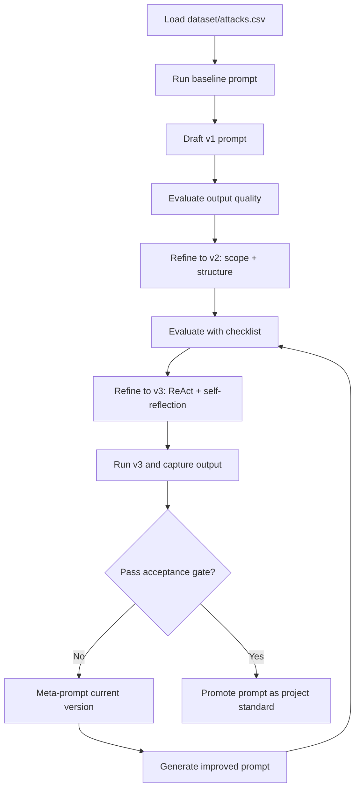

# Prompt Engineering Practice

This repository practices prompt design for reliable CSV analysis on `dataset/attacks.csv`.
The objective is to produce evidence-grounded insights with explicit uncertainty and a stable output format.

## Quick Scope

- **Dataset**: `dataset/attacks.csv`
- **Common columns**: `Year`, `Country`, `Type`, `Activity`, `Injury`, `Fatal (Y/N)`, `Age`, `Time`
- **Typical data risks**: missing values, inconsistent labels, noisy text

## ReAct Prompt Standard

Every production-ready prompt in this repository should enforce:
1. Domain role first (analyst perspective).
2. Explicit fields and analysis scope.
3. ReAct flow: field selection -> data-quality check -> findings -> self-critique -> claim revision.
4. Strict response schema with section and bullet limits.
5. Safety constraints: no fabricated metrics, uncertainty disclosure, confidence labels.

## Prompt Progression (v1 -> v2 -> v3)

### v1 (too broad)

```text
Act as a data scientist. Analyze the shark attacks dataset and provide key insights in bullet points.
```

**Gap**: role exists, but scope and verification are weak.

### v2 (better structure)

```text
Act as a data scientist.
Analyze attacks.csv using Year, Country, Type, Activity, Injury, and Fatal (Y/N).
Return:
1) Top trends
2) Fatality-related patterns
3) Data quality issues
4) Suggested follow-up analyses
Use bullet points and mark confidence levels.
```

**Gap**: better scope and format, but no mandatory self-correction loop.

### v3 (recommended)

Use `prompts/react-self-reflection-v3.txt` as the canonical prompt.

Key upgrades over v2:
- Mandatory self-critique per finding.
- Explicit claim revision/removal for weak evidence.
- Hard anti-hallucination and uncertainty rules.
- Consistent schema for cross-run comparison.

## Workflow Diagram



## Canonical v3 Prompt (Use As-Is)

```text
Act as a senior incident data analyst.

Context:
- Data source: dataset/attacks.csv
- Available columns may include: Case Number, Date, Year, Type, Country, Area, Location, Activity, Sex, Age, Injury, Fatal (Y/N), Time, Species.
- If a referenced column is missing or unusable, state it explicitly and continue with available evidence.

Goals:
1. Extract the most important incident and risk patterns supported by data.
2. Separate confirmed findings from assumptions and recommendations.
3. Produce a concise, decision-ready summary for non-technical stakeholders.

Method (ReAct + self-reflection):
1. Field selection: list the columns you will use and justify why each is relevant.
2. Data quality check: identify missing values, inconsistent labels, noisy text, and potential duplicates that may affect conclusions.
3. Evidence-based findings: derive trends from available columns (time, geography, activity, injury/fatality, demographics where possible).
4. Self-critique each finding:
   - Is this claim directly supported by observed fields or records?
   - Could data quality gaps bias this conclusion?
   - What confidence level is appropriate: High, Medium, or Low?
5. Claim revision: downgrade confidence, rewrite, or remove weak/speculative claims before final output.

Output schema (strict):
Section A - Key insights
- 5-8 bullet points.
- Each bullet must contain:
  - Insight statement
  - Evidence (specific columns and/or observed record patterns)
  - Confidence: High | Medium | Low

Section B - Data quality caveats
- 3-5 bullet points.
- Each bullet must include impact on interpretation.

Section C - Recommended next analyses
- Exactly 3 bullet points.
- Must be feasible follow-ups based on available columns.

Section D - Executive summary
- Maximum 5 lines.
- Plain language, stakeholder-friendly.

Constraints:
- Do not fabricate metrics or exact numbers that were not computed from the data.
- If evidence is partial, disclose uncertainty explicitly.
- Do not present assumptions as confirmed facts.
- Keep wording concise and actionable.
```

## Quality Checklist and Acceptance Gate

Score each criterion from 1 (weak) to 5 (strong):
- Clarity
- Specificity
- Grounding
- Hallucination resistance
- Consistency
- Actionability

Accept a prompt only if:
- Average score >= 4.0
- No fabricated metrics
- No unlabeled speculative claims

## Minimal Runbook

1. Run baseline, `v1`, `v2`, and `v3` on the same data sample.
2. Compare outputs with the checklist.
3. If needed, meta-prompt the current best version and rerun.
4. Promote only prompts that pass the acceptance gate.
