# Prompt Engineering Practice

A hands-on project for designing and iterating **ReAct-style prompts** that analyze shark attack data.  
Goal: evidence-grounded answers with explicit confidence levels and a stable output shape across all prompt versions.


---

## Table of contents

- [What it does](#what-it-does)
- [Project structure](#project-structure)
- [How to run](#how-to-run)
- [Execution flow](#execution-flow)
- [Prompt file format](#prompt-file-format)
- [Prompt versions](#prompt-versions)
- [Research question](#research-question)
- [Output schema](#output-schema-sections-ad)
- [ReAct reasoning cycle](#react-reasoning-cycle)
- [Quality checklist](#quality-checklist)

---

## What it does

| Step | Description |
| :---: | --- |
| 1 | Load up to `MaximumDatasetRecordCount` rows from `dataset/attacks.csv` |
| 2 | Inject them as XML `<record>` elements into each prompt template |
| 3 | Run each prompt in `ReActSequence` order — one LLM call per prompt |
| 4 | Pass each completion as `<prior_run>` into the next prompt (cross-version chaining) |
| 5 | Save each LLM response as a timestamped `.md` file in `OutputDirectory` |

---

## Project structure

```mermaid
graph TD
    ROOT["📁 prompt-engineering/"]

    ROOT --> DATASET["📁 dataset/"]
    ROOT --> PROMPTS["📁 prompts/"]
    ROOT --> OUTPUT["📁 output/"]
    ROOT --> SRC["📁 src/"]
    ROOT --> TESTS["📁 tests/"]

    DATASET --> DS_FILE["attacks.csv\nSource data"]

    PROMPTS --> P_INIT["initial.json\nFirst in ReAct sequence"]
    PROMPTS --> P_V1["v1.json\nBaseline, minimal scaffolding"]
    PROMPTS --> P_V2["v2.json\nSection headings + confidence labels"]
    PROMPTS --> P_V3["v3.json\nFull ReAct + 5-step self-reflection"]
    PROMPTS --> P_ANS["answer.json\nFinal answer prompt"]

    OUTPUT --> OUT_FILE["completion_&lt;stem&gt;_&lt;timestamp&gt;.md\nSaved LLM responses"]

    SRC --> CLIENT["PromptEngineering.Client\nConsole app — entry point"]
    SRC --> SERVICES["PromptEngineering.Services\nPipeline orchestration"]
    SRC --> LLM["PromptEngineering.LLM\nEPAM DIAL / OpenAI integration"]
    SRC --> MODEL["PromptEngineering.Model\nShared domain models"]

    TESTS --> TEST_PROJ["PromptEngineering.Services.Tests\nUnit tests for ContextService"]

    style ROOT fill:#1e1e2e,color:#cdd6f4,stroke:#89b4fa
    style DATASET fill:#1e1e2e,color:#cdd6f4,stroke:#a6e3a1
    style PROMPTS fill:#1e1e2e,color:#cdd6f4,stroke:#f9e2af
    style OUTPUT fill:#1e1e2e,color:#cdd6f4,stroke:#cba6f7
    style SRC fill:#1e1e2e,color:#cdd6f4,stroke:#89b4fa
    style TESTS fill:#1e1e2e,color:#cdd6f4,stroke:#f38ba8
    style DS_FILE fill:#313244,color:#a6e3a1,stroke:#a6e3a1
    style P_INIT fill:#313244,color:#f9e2af,stroke:#f9e2af
    style P_V1 fill:#313244,color:#f9e2af,stroke:#f9e2af
    style P_V2 fill:#313244,color:#f9e2af,stroke:#f9e2af
    style P_V3 fill:#313244,color:#f9e2af,stroke:#f9e2af
    style P_ANS fill:#313244,color:#f9e2af,stroke:#f9e2af
    style OUT_FILE fill:#313244,color:#cba6f7,stroke:#cba6f7
    style CLIENT fill:#313244,color:#89b4fa,stroke:#89b4fa
    style SERVICES fill:#313244,color:#89b4fa,stroke:#89b4fa
    style LLM fill:#313244,color:#89b4fa,stroke:#89b4fa
    style MODEL fill:#313244,color:#89b4fa,stroke:#89b4fa
    style TEST_PROJ fill:#313244,color:#f38ba8,stroke:#f38ba8
```



---

## How to run

### Prerequisites

- .NET 8+
- Access to an EPAM DIAL deployment (or any OpenAI-compatible endpoint)

### 1 — Configure `appsettings.json`

`src/PromptEngineering.Client/appsettings.json` controls all runtime settings:

<details>
<summary>Show full configuration</summary>

```json
{
  "SystemSettings": {
    "MaximumDatasetRecordCount": 10,
    "AiServiceSettings": {
      "BaseAddress": "<DIAL base URL>",
      "Instances": [
        {
          "Name": "AIArchitect.PromptEngineering",
          "ApiKey": "<your API key>",
          "Deployment": "gpt-4o-2024-05-13"
        }
      ]
    }
  },
  "ContextSettings": {
    "Temperature": 0.3,
    "PromptPath": "<absolute path to prompts/>",
    "DatasetPath": "<absolute path to dataset/attacks.csv>",
    "OutputDirectory": "<absolute path to output/>",
    "ReActSequence": ["initial.json", "v1.json", "v2.json", "v3.json", "answer.json"]
  }
}
```

</details>

### 2 — Set credentials via user secrets

> [!IMPORTANT]
> Never commit `ApiKey` or `BaseAddress` to source control. Use .NET user secrets instead.

```powershell
cd src/PromptEngineering.Client
dotnet user-secrets set "SystemSettings:AiServiceSettings:BaseAddress" "https://..."
dotnet user-secrets set "SystemSettings:AiServiceSettings:Instances:0:ApiKey" "your-key"
```

### 3 — Run

```powershell
cd src
dotnet run --project PromptEngineering.Client
```

---

## Execution flow

`RunReActAsync` processes all prompts in `ReActSequence` in order.  
Each completion is automatically injected as `<prior_run>` into the next prompt:

```
initial.json  ──►  completion_initial_<timestamp>.md
      │ <prior_run>
      ▼
v1.json       ──►  completion_v1_<timestamp>.md
      │ <prior_run>
      ▼
v2.json       ──►  completion_v2_<timestamp>.md
      │ <prior_run>
      ▼
v3.json       ──►  completion_v3_<timestamp>.md
      │ <prior_run>
      ▼
answer.json   ──►  completion_answer_<timestamp>.md
```

> [!NOTE]
> Prompts without a `<prior_run>...</prior_run>` region silently ignore the injected content.

---

## Prompt file format

Each prompt is a JSON file with two string arrays, joined by newlines at runtime:

```json
{
  "DefaultAssistantRole": ["System instruction line 1", "line 2"],
  "DefaultUserPrompt":   ["User message line 1", "<data></data>", "line 3"]
}
```

At runtime the `<data></data>` block is replaced with one `<record>` element per loaded CSV row.

### Injected XML fields

| XML element | CSV source column |
| :--- | :--- |
| `Year` | Year |
| `Country` | Country |
| `Area` | Area |
| `Type` | Type |
| `Activity` | Activity |
| `Injury` | Injury |
| `FatalYN` | Fatal (Y/N) |
| `Sex` | Sex |
| `Age` | Age |
| `Time` | Time |
| `Species` | Species |
| `InvestigatorSource` | Investigator or Source |

> [!NOTE]
> Empty tags indicate missing values. Special characters (`<`, `>`, `&`, `"`, `'`) are XML-escaped automatically.

---

## Prompt versions

| Version | File | What it adds |
| :--- | :--- | :--- |
| **initial** | `initial.json` | Entry point — mandatory Thought/Action/Observation, `<prior_run>` chaining, Sections A–D |
| **v1** | `v1.json` | Baseline — same research question, minimal structure |
| **v2** | `v2.json` | Numbered goals, fixed section headings, confidence labels |
| **v3** | `v3.json` | Mandatory Thought → Action → Observation + 5-step self-reflection, strict Sections A–D |
| **answer** | `answer.json` | Final synthesized answer built from all prior completions |

> [!TIP]
> Use `initial.json` as the starting point for new prompts. Use `v3.json` as a reference for standalone single-turn runs.

---

## Research question

> In the provided records from `attacks.csv`, how do **Activity** and encounter **Type** relate to harm outcomes (**FatalYN** and **Injury**), and which **data-quality issues** most limit how strong those conclusions can be?

| Field role | Fields |
| :--- | :--- |
| **Primary** | `Type`, `Activity`, `Injury`, `FatalYN` |
| **Supporting** | `Year`, `Country`, `Area`, and others as needed |

---

## Output schema (Sections A–D)

Used by `initial.json` and `v3.json`:

| Section | Content | Bullet limit |
| :--- | :--- | :---: |
| **A — Findings** | Key insight + supporting elements + `Confidence: High / Medium / Low` | 3–5 |
| **B — Data quality caveats** | Each risk tied to a specific interpretation impact | 3–5 |
| **C — Next analyses** | Feasible next steps on the same fields | max 3 |
| **D — Executive summary** | Short summary; no new unsupported claims | max 3 |

---

## ReAct reasoning cycle

The model internally completes this loop **before** writing Sections A–D:

**Loop** (repeated until claims are stable)

```
Thought      →  plan what to look at and why
Action       →  apply analytical steps to the injected <record> data
Observation  →  note what the records show or lack
```

**5-step self-reflection** (after the loop)

| Step | Description |
| :---: | :--- |
| 1 | Select fields and justify relevance |
| 2 | Identify data quality risks |
| 3 | Derive findings from evidence |
| 4 | Self-critique each finding for support strength and bias |
| 5 | Revise or remove weak claims |

> [!NOTE]
> The visible output is always Sections A–D only. Internal reasoning is not shown.

---

## Quality checklist

Score each response **1** (weak) → **5** (strong):

| Criterion | Question to ask |
| :--- | :--- |
| Clarity | Is the response easy to understand? |
| Specificity | Are claims tied to specific fields or records? |
| Grounding | Is every finding backed by injected data? |
| Hallucination resistance | Are there any fabricated metrics or tool results? |
| Consistency | Does the output match the schema? |
| Actionability | Are next steps concrete and feasible? |

> [!IMPORTANT]
> **Accept** a prompt only if the average score is **≥ 4.0**, with no fabricated metrics and no unlabeled speculation.

**If quality stalls:** apply meta-prompting — ask an LLM to revise the prompt while preserving intent, improving grounding, and enforcing the output schema. Then re-run and re-score.
