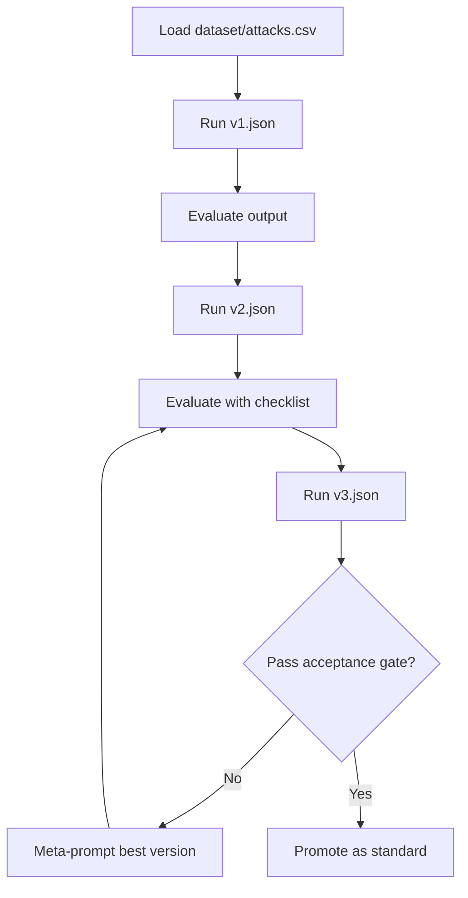

# Prompt Engineering Practice

This repository practices **ReAct-style prompt design** for reliable analysis of `dataset/attacks.csv`. The goal is **evidence-grounded** answers with **explicit uncertainty**, **confidence labels**, and a **stable output shape** so runs are comparable.

---

## How prompts run

- Prompts live in [`prompts/`](prompts/) as **`v1.json`**, **`v2.json`**, **`v3.json`** (processed in **file-name order**).
- Each file defines two string arrays: `DefaultAssistantRole` (system) and `DefaultUserPrompt` (user). The client **joins array entries with newlines** into the messages sent to the model.
- The user prompt must contain a `<data>...</data>` region. At runtime, the app **replaces the inner part** with one `<record>...</record>` per loaded CSV row (see [Injected XML](#injected-xml-one-record-per-row)).
- Paths for prompts, dataset, and output are configured under `ContextSettings` in [`src/PromptEngineering.Client/appsettings.json`](src/PromptEngineering.Client/appsettings.json).

---

## Injected XML (one record per row)

The pipeline maps selected CSV columns into XML tags (names are fixed; empty tags mean missing values in the source row).

| XML element | Source column (conceptual) |
|-------------|----------------------------|
| `Year` | Year |
| `Country` | Country |
| `Area` | Area |
| `Type` | Type |
| `Activity` | Activity |
| `Injury` | Injury |
| `FatalYN` | Fatal (Y/N) |
| `Sex` | Sex (CSV header may include a trailing space) |
| `Age` | Age |
| `Time` | Time |
| `Species` | Species (CSV header may include a trailing space) |
| `InvestigatorSource` | Investigator or Source |

The raw CSV has additional columns (e.g. Case Number, Date, links). They are **not** injected unless the loader is extended; analyses should rely on the elements above.

---

## ReAct prompt standard (repository rule)

Production-ready prompts here should enforce:

1. **Role first** — domain-relevant analyst, not a generic assistant.
2. **Explicit scope** — which fields and which questions (see **Q1–Q3** below).
3. **ReAct flow** — field selection → data-quality check → evidence-based findings → **self-critique** → **claim revision** before the final answer.
4. **Strict response schema** — section headings and **bullet limits** (see **v3**).
5. **Safety** — no fabricated metrics; disclose partial evidence; **High / Medium / Low** confidence on substantive claims.

---

## Research questions (Q1–Q3)

All three prompt versions target the same analytical frame:

| ID | Theme | Core elements |
|----|--------|----------------|
| **Q1** | Geography, time, encounter classification | Year, Country, Area, Type, FatalYN |
| **Q2** | Activity, demographics, harm | Activity, Sex, Age, Injury, FatalYN |
| **Q3** | Species and time-of-day | Species, Time, Type, FatalYN, Country (optional: InvestigatorSource) |

**Ordering:** Prefer **Q1** and **Q2** (cleaner dimensions) before **Q3** (noisier free text and sparse `Time`).

---

## Prompt progression (v1 → v2 → v3)

| Version | File | Intent | ReAct |
|---------|------|--------|--------|
| **v1** | [`prompts/v1.json`](prompts/v1.json) | Baseline: same Q1–Q3, minimal scaffolding; notes that v2/v3 add formal checks | Not required (direct answers still must cite `<record>` evidence) |
| **v2** | [`prompts/v2.json`](prompts/v2.json) | **Numbered outcomes**, field hints per question, fixed **section headings**, confidence on substantive bullets | Implicit (quality + follow-ups explicit; no mandatory 5-step loop) |
| **v3** | [`prompts/v3.json`](prompts/v3.json) | **Canonical**: full **5-step** ReAct + self-reflection; **strict** Sections A–E and bullet caps | **Mandatory** |

**Gaps each step fixes:** v1 → v2 adds structure and confidence discipline; v2 → v3 adds mandatory self-critique, claim revision, and a rigid schema for cross-run comparison.

---

## v3 output schema (canonical)

Section titles and limits match [`prompts/v3.json`](prompts/v3.json):

- **Section A — Q1 findings:** 3–5 bullets (insight; supporting elements; Confidence: High | Medium | Low).
- **Section B — Q2 findings:** same.
- **Section C — Q3 findings:** same; call out Species/Time limits where needed.
- **Section D — Data quality caveats:** 3–5 bullets (each ties a risk to interpretation).
- **Section E — Executive summary:** ≤5 lines; no new unsupported claims.

---

## Workflow

---

## Quality checklist and acceptance gate

Score 1 (weak) to 5 (strong):

- Clarity  
- Specificity  
- Grounding  
- Hallucination resistance  
- Consistency  
- Actionability  

**Accept** only if average ≥ **4.0**, with **no fabricated metrics** and **no unlabeled speculation** passed off as fact.

---

## Minimal runbook

1. Point `ContextSettings:PromptPath` at the `prompts` folder and `DatasetPath` at `dataset/attacks.csv`.
2. Run the client pipeline so **v1**, then **v2**, then **v3** execute (or run a single file by using a folder with only that JSON).
3. Compare outputs using the checklist above.
4. If quality stalls, **meta-prompt** the current best version (preserve intent, tighten grounding and schema) and re-run.
5. Treat **v3** as the default template for new incident-style prompts in this repo.
