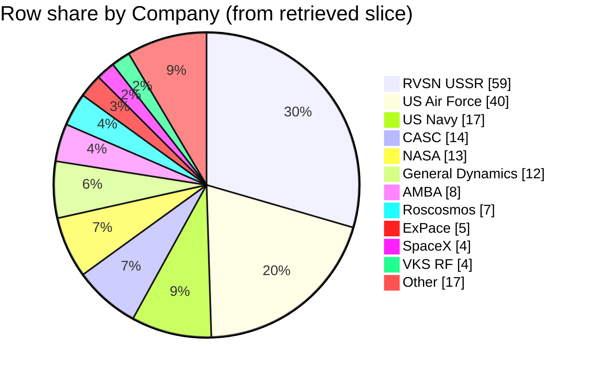

### Field selection and filters

*   **Fields used:** The analysis uses the `Company`, `Mission`, and `Date` columns from the provided context to identify and count missions for each operator [1, 2, 3, 4].
*   **Row scope:** All 200 rows retrieved across the four context blocks are included in the analysis [1, 2, 3, 4].
*   **Company bucketing rule:** Each unique operator is bucketed based on the verbatim, whitespace-trimmed string in the `Company` column. No merging or canonicalization of names (e.g., `RVSN USSR` and `Roscosmos` are treated as distinct) is performed [1, 2, 3, 4].

### Data quality and confidence

*   **Confidence:** `High` for the calculations performed on the retrieved 200-row slice; `Low` for generalizing these shares to the entire dataset.
*   **Data integrity:** The `Company` field is present in all 200 retrieved rows, so there are no missions with missing operator data [1, 2, 3, 4].
*   **Retrieval bias:** The provided context is heavily clustered into three distinct time periods: 1957-1961 [1, 2], 1967-1968 [3], and 2019 [4]. This significantly skews the results, over-representing operators from the early space race and the modern era, while completely omitting data from the 1970s through the 2010s.
*   **Dominant operators:** The slice is dominated by a few operators, primarily `RVSN USSR` [1, 2, 3] and `US Air Force` [1, 2, 3], which together account for nearly half of the missions in the retrieved data.

### Company assignment examples

*   A row with `Company` "RVSN USSR" for the `Sputnik-1` mission on `1957-10-04` is counted in the `RVSN USSR` bucket [1].
*   A row with `Company` "US Air Force" for the `Pioneer 5` mission on `1960-03-11` is counted in the `US Air Force` bucket [2].
*   A row with `Company` "NASA" for the `Apollo 4` mission on `1967-11-09` is counted in the `NASA` bucket [3].
*   A row with `Company` "CASC" for the `Yaogan-30-05` mission on `2019-07-26` is counted in the `CASC` bucket [4].

### Extracted table

| Company bucket | Row count | % of rows in slice |
| :--- | :--- | :--- |
| RVSN USSR | 59 | 29.5% |
| US Air Force | 40 | 20.0% |
| US Navy | 17 | 8.5% |
| CASC | 14 | 7.0% |
| NASA | 13 | 6.5% |
| General Dynamics | 12 | 6.0% |
| AMBA | 8 | 4.0% |
| Roscosmos | 7 | 3.5% |
| ExPace | 5 | 2.5% |
| SpaceX | 4 | 2.0% |
| VKS RF | 4 | 2.0% |
| Rocket Lab | 3 | 1.5% |
| ISRO | 2 | 1.0% |
| Arianespace | 2 | 1.0% |
| ULA | 2 | 1.0% |
| Northrop | 2 | 1.0% |
| OKB-586 | 1 | 0.5% |
| i-Space | 1 | 0.5% |
| ISA | 1 | 0.5% |
| MHI | 1 | 0.5% |
| ILS | 1 | 0.5% |
| Exos | 1 | 0.5% |
| Unnamed / missing | 0 | 0.0% |
| **Total** | **200** | **100.0%** |

### Self-critique

*   **Top buckets (evidence depth):** Support for the top three buckets is `High`. `RVSN USSR` has 59 rows, with examples like the `Sputnik-1` mission on `1957-10-04` [1]. `US Air Force` has 40 rows, including the `Discoverer 2` mission on `1959-04-13` [1]. `US Navy` has 17 rows, such as the `Vanguard TV3` mission on `1957-12-06` [1]. All are well-supported by multiple retrieved rows.
*   **Label semantics:** The analysis treats different strings as distinct buckets per the instructions. This means historically or nationally related entities are counted separately, such as `RVSN USSR` [1, 2, 3], `Roscosmos` [4], and `VKS RF` [4] for Russia, or `US Navy` [1], `US Air Force` [1, 2, 3], `NASA` [1, 2, 3], and `AMBA` [1, 3] for the United States. The shares do not represent a unified "national program" view.
*   **Totals / scope:** The counts for all 22 company buckets sum to 200, which is the total number of rows in the retrieved context [1, 2, 3, 4]. The `Unnamed / missing` bucket has a count of 0 [1, 2, 3, 4]. The data dictionary was not provided in the context, so the formal definition of the `Company` column cannot be verified.
*   **Retrieval bias:** The retrieved rows are not a random sample but are clustered in three specific periods: 1957-1961 [1, 2], 1967-1968 [3], and 2019 [4]. This temporal bias means the shares are skewed towards operators active during the start of the space race and the modern era, and cannot be considered representative of the full dataset's history.
*   **Chart fidelity (numeric):** The pie chart uses the same row counts as the table. Because there are 22 buckets with positive counts, the chart displays the top 11 and groups the remaining 11 into an `Other` slice. The `Other` slice has a value of 17, which is the sum of the counts for Rocket Lab (3), ISRO (2), Arianespace (2), ULA (2), Northrop (2), OKB-586 (1), i-Space (1), ISA (1), MHI (1), ILS (1), and Exos (1) [1, 2, 3, 4]. This rollup hides the performance of smaller operators.
*   **Overlap / double-count hazard:** The risk of double-counting is `Low`. Each context block provides source row numbers (e.g., `row: 1`, `row: 51`, `row: 601`, `row: 4201`) which are unique and non-overlapping across the provided context, indicating distinct records were retrieved [1, 2, 3, 4].

### Chart

### Summary

Based on the 200 retrieved mission rows, `RVSN USSR` is the most frequent operator, accounting for 29.5% of the missions, followed by `US Air Force` with 20.0% [1, 2, 3]. Per the rules, related entities like `RVSN USSR` and `Roscosmos` are counted as separate operators, affecting how national shares are interpreted [1, 2, 3, 4]. The provided data is heavily clustered in the late 1950s, late 1960s, and 2019, so these findings are not representative of the full history of space missions and omit decades of activity [1, 2, 3, 4].