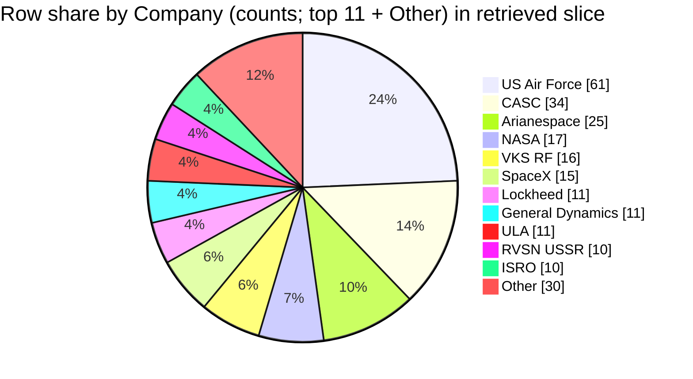

## Field selection and filters
- Fields used to identify and bucket rows: `Company`, `Mission`, `Date` (and `Location` when helpful to disambiguate). [1][2][3][4]
- **Scope filter:** all rows present in the retrieved context blocks (no additional filters applied). [1][2][3][4]
- **Company bucket rule:** bucket = **trimmed exact** `Company` string; if empty after trim → `Unnamed / missing`. [1][2][3][4]
- Counting method: one count per retrieved CSV row (identified by its `Mission` + `Date` combination in citations). [1][2][3][4]

## Data quality and confidence
- Confidence: **Medium** — the slice is limited to the retrieved rows shown (not the full CSV), so operator shares may not match the full dataset. [1][2][3][4]
- No `Company` values appear empty in the retrieved rows, so `Unnamed / missing` is **0** in this slice. [1][2][3][4]
- The data dictionary file (`docs/applications/rag/space_missions_data_dictionary.md`) was **not retrieved**, so I cannot verify column semantics (e.g., the formal definition of `Company`) from it. [1][2][3][4]
- Retrieved rows are time-clustered into a few periods (1961–1962; 1999–2001; 2014–2016; 2018–2019), which can skew “top companies” within this slice. [1][2][3][4]

## Company assignment examples
- Example bucket = `Northrop` (trimmed): Mission `Orbcomm D1-D8`, Date `1999-12-04`. [1]
- Example bucket = `SpaceX` (trimmed): Mission `CRS-5`, Date `2015-01-10`. [2]
- Example bucket = `US Air Force` (trimmed): Mission `Explorer 10`, Date `1961-03-25`. [3]
- Example bucket = `Arianespace` (trimmed): Mission `Merah Putih (Telkom-4)`, Date `2018-08-07` is **not** Arianespace; Arianespace example: Mission `ADM-Aeolus`, Date `2018-08-22`. [4]

## Extracted table
Denominator (rows in slice) = **200** total retrieved rows. [1][2][3][4]

| Company bucket | Row count | % of rows in slice |
|---|---:|---:|
| US Air Force | 61 | 30.5% |
| CASC | 34 | 17.0% |
| Arianespace | 25 | 12.5% |
| NASA | 17 | 8.5% |
| VKS RF | 16 | 8.0% |
| SpaceX | 15 | 7.5% |
| Lockheed | 11 | 5.5% |
| General Dynamics | 11 | 5.5% |
| ULA | 11 | 5.5% |
| RVSN USSR | 10 | 5.0% |
| ISRO | 10 | 5.0% |
| Boeing | 9 | 4.5% |
| MHI | 7 | 3.5% |
| Sea Launch | 5 | 2.5% |
| ISA | 4 | 2.0% |
| Northrop | 4 | 2.0% |
| Roscosmos | 4 | 2.0% |
| ILS | 4 | 2.0% |
| Eurockot | 2 | 1.0% |
| Blue Origin | 2 | 1.0% |
| Exos | 2 | 1.0% |
| MITT | 2 | 1.0% |
| ISAS | 2 | 1.0% |
| Sandia | 1 | 0.5% |
| KCST | 1 | 0.5% |
| ExPace | 1 | 0.5% |
| Rocket Lab | 1 | 0.5% |
| Landspace | 1 | 0.5% |
| OneSpace | 1 | 0.5% |
| Kosmotras | 1 | 0.5% |
| AEB | 1 | 0.5% |
| JAXA | 1 | 0.5% |
| Khrunichev | 1 | 0.5% |
| Unnamed / missing | 0 | 0.0% |

## Self-critique
- **Top buckets (evidence depth):** `US Air Force` (**High** support; many retrieved rows in 1961–1962) e.g., `Explorer 10` on `1961-03-25` shows `Company: US Air Force`. [3] `CASC` (**High** support; many retrieved rows in 2015–2019) e.g., `ChinaSat-22` on `2000-01-25` shows `Company: CASC`. [1] `Arianespace` (**High** support; many retrieved rows across 1999–2019) e.g., `XMM-Newton` on `1999-12-10` shows `Company: Arianespace`. [1]
- **Label semantics:** Shares are by **exact string**; near-duplicates/related entities (e.g., `RVSN USSR` vs `VKS RF` vs `Roscosmos`) remain separate buckets here, so “one company” interpretation may be misleading. [2][3][4]
- **Totals / scope:** Counts sum to **200** rows (the slice denominator), and `Unnamed / missing` is explicitly **0**; also, the data dictionary was not retrieved, so I cannot confirm the formal meaning of `Company` from it. [1][2][3][4]
- **Retrieval bias:** Retrieved context is not a random sample and is time-clustered (1961–1962; 1999–2001; 2014–2016; 2018–2019), so “largest operators” likely differ from the full CSV. [1][2][3][4]
- **Chart fidelity (numeric):** The pie chart below uses the **same unit as the table (row counts)**; because there are **>12** positive buckets, the pie uses **top 11 + Other**, where `Other` equals the sum of all remaining positive buckets (200 − 170 = 30). [1][2][3][4]
- **Overlap / double-count hazard:** Double-count risk is **Medium** because the context is split into multiple blocks and I cannot verify whether any row is duplicated across blocks; I mitigated by counting each displayed row once per block, but cannot guarantee no cross-block duplication without row IDs. [1][2][3][4]

## Chart

## Summary
In the retrieved 200-row slice, `US Air Force` has the largest share (61 rows, 30.5%), followed by `CASC` (34, 17.0%) and `Arianespace` (25, 12.5%). [1][2][3][4] These shares are sensitive to exact-string labeling (e.g., `RVSN USSR`, `VKS RF`, `Roscosmos` are separate buckets). [2][3][4] Because only a time-clustered subset of rows was retrieved and the data dictionary was not provided, the results may not represent the full CSV and column semantics cannot be fully verified. [1][2][3][4]