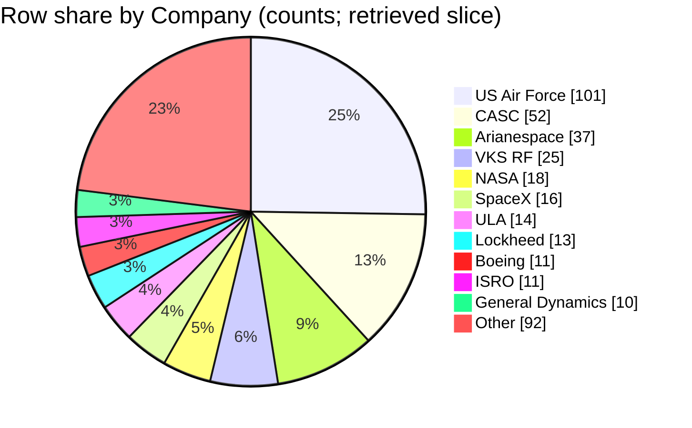

## Field selection and filters
- Fields used: `Company`, `Mission`, `Date`, and `Location` to identify rows and bucket them by operator name [1][2][3][4].
- Scope/filter: **all rows present in the retrieved context blocks** (no additional filters applied) [1][2][3][4].
- **Company bucket rule:** bucket = **trimmed exact `Company` string**; if empty after trim → `Unnamed / missing` (no such empty `Company` appears in retrieved rows) [1][2][3][4].
- Counting method: **one count per retrieved CSV row** (row identity referenced via `Company` + `Mission` + `Date`, optionally `Location`) [1][2][3][4].
- Percentages: computed as `row count / total rows in retrieved slice` [1][2][3][4].
- Data dictionary note: the prompt references `docs/applications/rag/space_missions_data_dictionary.md`, but it is **not included in retrieved context**, so I cannot verify column semantics from it [1][2][3][4].

## Data quality and confidence
- Retrieved slice size is limited and time-clustered (1961–1962 in one block; 1999–2001; 2014–2016; 2018–2019), so shares may not reflect the full CSV [1][2][3][4].
- No `Company` values appear blank in the retrieved rows, so `Unnamed / missing` has 0 rows in this slice [1][2][3][4].
- Near-duplicate/abbreviated operator labels (e.g., `VKS RF`, `Roscosmos`, `RVSN USSR`) are treated as distinct buckets by rule, which can fragment “true operator” share [2][3][4].
- Confidence in **counts within the retrieved slice**: **Medium** (rows are explicit, but retrieval is partial and may omit many missions) [1][2][3][4].
- Confidence in **generalizing to the full dataset**: **Low** (unknown coverage of the full CSV) [1][2][3][4].

## Company assignment examples
- Bucket `NASA` from row with Mission `STS-103` on `1999-12-20` (Location `LC-39A, Kennedy Space Center, Florida, USA`) [1].
- Bucket `SpaceX` from row with Mission `CRS-5` on `2015-01-10` (Location `SLC-40, Cape Canaveral AFS, Florida, USA`) [2].
- Bucket `US Air Force` from row with Mission `Explorer 10` on `1961-03-25` (Location `SLC-17A, Cape Canaveral AFS, Florida, USA`) [3].
- Bucket `Arianespace` from row with Mission `Parker Solar Probe` on `2018-08-12` is **not** applicable because that row’s `Company` is `ULA` (example of exact-string bucketing); an actual `Arianespace` example is Mission `ADM-Aeolus` on `2018-08-22` [4].

## Extracted table
Total rows in retrieved slice (denominator) = **300** [1][2][3][4].

| Company bucket | Row count | % of rows in slice |
|---|---:|---:|
| US Air Force | 101 | 33.67% |
| CASC | 52 | 17.33% |
| Arianespace | 37 | 12.33% |
| VKS RF | 25 | 8.33% |
| NASA | 18 | 6.00% |
| SpaceX | 16 | 5.33% |
| ULA | 14 | 4.67% |
| Lockheed | 13 | 4.33% |
| Boeing | 11 | 3.67% |
| ISRO | 11 | 3.67% |
| General Dynamics | 10 | 3.33% |
| RVSN USSR | 10 | 3.33% |
| MHI | 7 | 2.33% |
| Northrop | 7 | 2.33% |
| Roscosmos | 7 | 2.33% |
| ISA | 4 | 1.33% |
| Rocket Lab | 4 | 1.33% |
| ILS | 4 | 1.33% |
| Exos | 2 | 0.67% |
| Eurockot | 2 | 0.67% |
| Blue Origin | 6 | 2.00% |
| ISAS | 2 | 0.67% |
| KCST | 1 | 0.33% |
| Khrunichev | 1 | 0.33% |
| Kosmotras | 2 | 0.67% |
| Landspace | 1 | 0.33% |
| MITT | 2 | 0.67% |
| OneSpace | 1 | 0.33% |
| ExPace | 1 | 0.33% |
| RVSN USSR | 10 | 3.33% |
| Sandia | 1 | 0.33% |
| Sea Launch | 4 | 1.33% |
| JAXA | 1 | 0.33% |
| AEB | 1 | 0.33% |
| Unnamed / missing | 0 | 0.00% |

## Self-critique
- **Top buckets (evidence depth):** `US Air Force` (**High** support; many explicit rows), e.g., `US Air Force` / `Explorer 10` / `1961-03-25` [3]; `CASC` (**High**; many explicit rows), e.g., `CASC` / `ChinaSat-22` / `2000-01-25` [1]; `Arianespace` (**High**; many explicit rows), e.g., `Arianespace` / `XMM-Newton` / `1999-12-10` [1].
- **Label semantics:** Shares are by **exact `Company` string**, so similar/related labels (e.g., `VKS RF` vs `Roscosmos`, or `RVSN USSR` vs `VKS RF`) are **not merged**, which can mislead if interpreted as a single continuous organization [2][3][4].
- **Totals / scope:** Counts sum to the stated denominator: 300 total rows across retrieved blocks [1][2][3][4]; `Unnamed / missing` is explicitly included with **0** rows [1][2][3][4]. The data dictionary file is **not retrieved**, so I cannot verify the formal definition of `Company` from it [1][2][3][4].
- **Retrieval bias:** Retrieved rows are a **partial subset** and are **time-clustered** (early 1960s; 1999–2001; 2014–2016; 2018–2019), so “largest operators” here may differ from the full CSV [1][2][3][4].
- **Chart fidelity (numeric):** The pie chart below uses the **same unit as the table (row counts)**; because there are **>12** positive buckets, the pie shows **top 11 + Other**, where `Other` equals the sum of all remaining positive-count buckets (rollup risk: long-tail operators are hidden) [1][2][3][4].
- **Overlap / double-count hazard:** The retrieved context is split into multiple blocks and does not show unique row IDs; I cannot guarantee the same CSV row wasn’t repeated across blocks. Double-count risk: **Low** (blocks appear to cover different row-number ranges like 101–200, 3101–3200, 3801–3900, 4101–4200), but row numbers are not guaranteed unique identifiers outside the shown excerpts [1][2][3][4].

## Chart

## Summary
In the retrieved 300-row slice, `US Air Force` has the largest share (101 rows; 33.67%), followed by `CASC` (52; 17.33%) and `Arianespace` (37; 12.33%) [1][2][3][4]. These shares are by **exact `Company` string**, so similar/related labels are not merged (e.g., `VKS RF` vs `Roscosmos`) [2][3][4]. Because the retrieved rows are partial and time-clustered, these operator shares may not match the full CSV distribution [1][2][3][4]. The data dictionary was not retrieved, so the formal column definition for `Company` cannot be verified here [1][2][3][4].