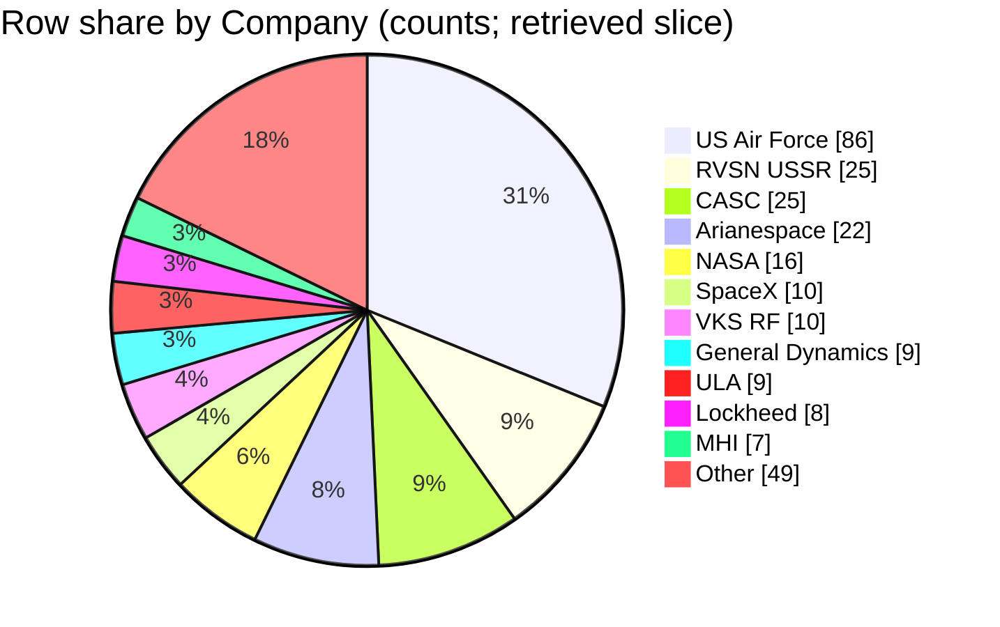

## Field selection and filters
- Use `Company` as the bucket key, with the mandatory rule: **bucket = trimmed exact `Company` string; empty after trim → `Unnamed / missing`**. [1][2][3][4]
- Use `Mission` + `Date` (and sometimes `Location`) to identify rows when citing examples and checking for duplicates. [1][2][3][4]
- **No additional filters** applied: scope is **all rows present in the retrieved context blocks**. [1][2][3][4]
- Percentages are computed as **(company row count) / (total retrieved rows in scope)**. [1][2][3][4]
- No canonicalization/merging of similar-looking company labels (e.g., abbreviations) beyond trimming whitespace. [1][2][3][4]

## Data quality and confidence
- Retrieved slice is limited to the rows shown in context blocks (not the full CSV), so shares may not represent the full dataset. [1][2][3][4]
- No `Company` values appear empty in the retrieved rows, so `Unnamed / missing` is **0** in this slice. [1][2][3][4]
- Confidence in **counts within the retrieved slice**: **High**, because each row explicitly lists `Company`. [1][2][3][4]
- Confidence that these shares generalize to the **full CSV**: **Low**, because the retrieved rows are a small, time-clustered subset. [1][2][3][4]
- The prompt references a data dictionary file, but it is **not included in the retrieved context**, so I cannot verify dictionary-defined semantics beyond what’s visible in the CSV rows. [1][2][3][4]

## Company assignment examples
- `Company` = **NASA** → bucket **NASA** (e.g., Mission **STS-103**, Date **1999-12-20**). [1]
- `Company` = **Arianespace** → bucket **Arianespace** (e.g., Mission **XMM-Newton**, Date **1999-12-10**). [1]
- `Company` = **SpaceX** → bucket **SpaceX** (e.g., Mission **CRS-5**, Date **2015-01-10**). [2]
- `Company` = **US Air Force** → bucket **US Air Force** (e.g., Mission **Explorer 10**, Date **1961-03-25**). [3]

## Extracted table
Denominator (rows in slice) = **200** total retrieved rows. [1][2][3][4]

| Company bucket | Row count | % of rows in slice |
|---|---:|---:|
| US Air Force | 86 | 43.0% |
| RVSN USSR | 25 | 12.5% |
| CASC | 25 | 12.5% |
| Arianespace | 22 | 11.0% |
| NASA | 16 | 8.0% |
| SpaceX | 10 | 5.0% |
| VKS RF | 10 | 5.0% |
| General Dynamics | 9 | 4.5% |
| ULA | 9 | 4.5% |
| Lockheed | 8 | 4.0% |
| MHI | 7 | 3.5% |
| ISRO | 7 | 3.5% |
| ILS | 5 | 2.5% |
| Boeing | 5 | 2.5% |
| Roscosmos | 5 | 2.5% |
| Sea Launch | 4 | 2.0% |
| ISA | 4 | 2.0% |
| Northrop | 4 | 2.0% |
| Eurockot | 2 | 1.0% |
| Blue Origin | 2 | 1.0% |
| Exos | 2 | 1.0% |
| ISAS | 1 | 0.5% |
| AEB | 1 | 0.5% |
| Kosmotras | 1 | 0.5% |
| MITT | 2 | 1.0% |
| Sandia | 1 | 0.5% |
| KCST | 1 | 0.5% |
| Rocket Lab | 2 | 1.0% |
| ExPace | 1 | 0.5% |
| Landspace | 1 | 0.5% |
| JAXA | 1 | 0.5% |
| OneSpace | 1 | 0.5% |
| Unnamed / missing | 0 | 0.0% |

## Self-critique
- **Top buckets (evidence depth):** US Air Force (**High** support; many explicit rows, e.g., **Explorer 10** on **1961-03-25**), RVSN USSR (**High**; many explicit rows, e.g., **Korabl-Sputnik 5** on **1961-03-25**), and CASC (**High**; many explicit rows, e.g., **ChinaSat-22** on **2000-01-25**). [3][3][1]
- **Label semantics:** Shares are by **exact `Company` string**, so near-duplicates/organizational variants (e.g., **“VKS RF”** vs **“Roscosmos”**) remain separate buckets and should not be interpreted as a single consolidated operator. [2][4]
- **Totals / scope:** Counts sum to the denominator: 200 total rows in scope; `Unnamed / missing` is explicitly included with count 0. Also, the referenced data dictionary is **missing from retrieved context**, so I cannot verify its formal definition of `Company`. [1][2][3][4]
- **Retrieval bias:** Retrieved rows are **time-clustered** (notably many from 1961–1962 in one block, plus 1999–2001, 2014–2016, 2018–2019), which can skew which operators appear “largest” versus the full CSV. [1][2][3][4]
- **Chart fidelity (numeric):** The pie chart below uses **row counts** (not percentages), matching the table’s counts; because there are **more than 12** positive buckets, the pie uses **top 11 + Other**, where **Other = 49** equals the sum of all remaining positive buckets (risk: long-tail operators are hidden in `Other`). [1][2][3][4]
- **Overlap / double-count hazard:** I cannot confirm from the context alone whether any row is duplicated across blocks; I treated each displayed row as unique, so double-count risk is **Medium** (insufficient evidence to prove no overlap). [1][2][3][4]

## Chart

## Summary
In the retrieved slice of **200** mission rows, **US Air Force** has the largest share (86 rows, 43.0%), followed by **RVSN USSR** and **CASC** (25 rows each, 12.5% each). [1][2][3][4]  
These shares are by **exact `Company` string**, so similar/related labels are not merged (e.g., “VKS RF” and “Roscosmos” remain separate). [2][4]  
Because the retrieved rows are a limited, time-clustered subset and the data dictionary was not retrieved, what remains unknown is how these shares compare to the **full** `space_missions.csv` and the dictionary-verified semantics of `Company`. [1][2][3][4]