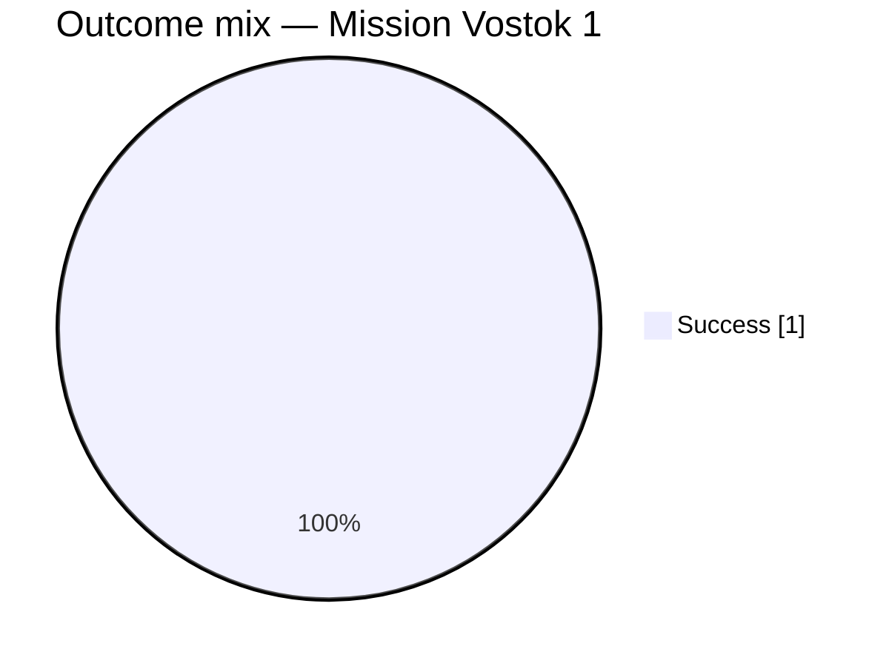

### **Field selection and filters**

The analysis uses the following fields and filters to identify the outcome for the Vostok 1 mission:
*   **Filter:** The primary filter applied to the data is `Mission` equals exactly `Vostok 1` [3].
*   **Fields:** The analysis extracts the `Mission`, `Rocket`, `Date`, and `MissionStatus` fields for each matching record to ensure clear identification and outcome categorization [3].
*   **Scope:** No additional filters, such as date ranges or locations, were applied, as none were specified in the request. The analysis is strictly limited to the provided context [1, 2, 3, 4].

### **Data quality and confidence**

*   **Sample Size:** The retrieved context contains exactly one record where the `Mission` is `Vostok 1` [3]. This is a tiny sample size.
*   **Data Integrity:** For the single identified record, the `MissionStatus` field is present and contains the value `Success` [3]. There are no missing outcome data points within the scoped selection.
*   **Confidence:** Confidence is **High** that the analysis accurately reflects the single retrieved data point. Confidence is **Low** that this single point represents the complete data for all missions of this type that might exist in the full, unprovided dataset.

### **Extracted table**

Based on the single retrieved record for the `Vostok 1` mission, the outcome distribution is as follows:

| MissionStatus | Count | Share of Non-Empty Outcomes |
| :--- | :--- | :--- |
| Success | 1 [3] | 100% |
| Failure | 0 | 0% |
| Partial Failure | 0 | 0% |
| Prelaunch Failure | 0 | 0% |
| **Total** | **1** | **100%** |

### **Self-critique**

*   **Direct Support:** The count of 1 for the `Success` category is directly supported by the `MissionStatus` value in the retrieved row for the Vostok 1 mission [3].
*   **Omissions:** The counts of zero for `Failure`, `Partial Failure`, and `Prelaunch Failure` are based on the absence of any other records for `Vostok 1` in the provided context [1, 2, 3, 4].
*   **Population Scope:** The analysis is strictly confined to the provided context. Since Vostok 1 was a unique historical event, finding a single record is expected. However, this analysis cannot confirm if other relevant records were omitted during retrieval.

### **Chart**

The following pie chart visualizes the outcome distribution for the Vostok 1 mission based on the single available record. Categories with a count of zero (`Failure`, `Partial Failure`, `Prelaunch Failure`) are excluded from the chart as per the instructions.

### **Summary**

Based on the provided context, there is one record for the `Vostok 1` mission, which occurred on April 12, 1961 [3]. This mission's outcome is listed as a `Success` [3]. Because the retrieved data contains only this single entry for the specified mission, the analysis shows a 100% success rate. The context is insufficient to perform a broader analysis or confirm if this is the only record that exists in the complete dataset.