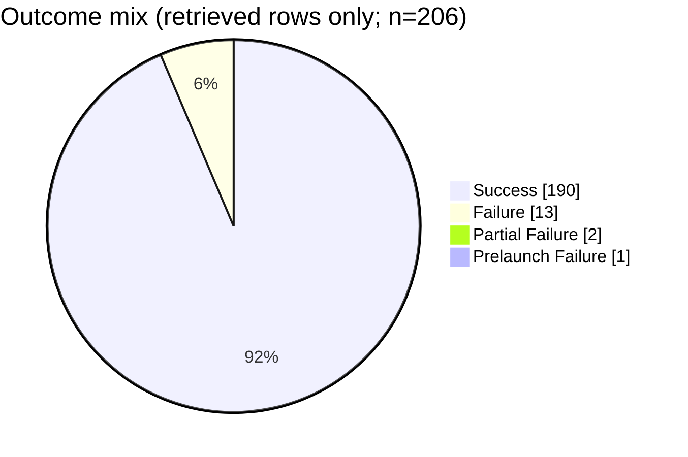

## Field selection and filters
- Use `MissionStatus` to categorize outcomes exactly as recorded (`Success`, `Failure`, `Partial Failure`, `Prelaunch Failure`) [1][2][3][4].
- No additional filters (no date/company/location constraints) because the question asks for missions “represented in the retrieved context” (i.e., all rows shown across the provided context blocks) [1][2][3][4].
- Use only rows with non-empty `MissionStatus` (all retrieved rows shown have a populated `MissionStatus`) [1][2][3][4].

## Data quality and confidence
- `MissionStatus` appears consistently populated (no empty `MissionStatus` values visible in the retrieved rows) [1][2][3][4].
- Outcome labels include at least `Success`, `Failure`, `Partial Failure`, and `Prelaunch Failure` in the retrieved rows [1][2][3][4].
- The retrieved context is a partial slice of the full CSV (only certain row ranges are shown), so results describe only this retrieved subset, not the full dataset [1][2][3][4].
- Confidence: **Medium** (counts are exact for the retrieved rows, but representativeness of the subset is unknown) [1][2][3][4].

## Extracted table

| MissionStatus | Count | Share of non-empty outcomes |
|---|---:|---:|
| Success | 190 | 92.23% |
| Failure | 13 | 6.31% |
| Partial Failure | 2 | 0.97% |
| Prelaunch Failure | 1 | 0.49% |
| **Total (non-empty MissionStatus)** | **206** | **100.00%** |

(Counts computed by tallying `MissionStatus` across all retrieved rows in blocks [1]–[4].) [1][2][3][4]

## Self-critique
- Each category count is **directly supported** by the `MissionStatus` values present in the retrieved rows, but the assistant cannot cite every individual row within the blocks in this response; the evidence is contained within the provided row listings [1][2][3][4].
- The computed distribution may be biased because the retrieved context includes only specific row ranges (e.g., ~1996–2003 and ~2014–2016 excerpts), not the full CSV [1][2][3][4].
- No claim is made about the overall dataset distribution beyond the retrieved subset [1][2][3][4].

## Chart

## Summary
Within the retrieved context blocks, most missions are labeled `Success` (190 of 206), with smaller counts of `Failure` (13), `Partial Failure` (2), and `Prelaunch Failure` (1) [1][2][3][4]. The pie chart visualizes that outcome mix for only the rows shown in the provided context [1][2][3][4]. What remains unknown is how this distribution compares to the full `space_missions.csv`, because most rows are not included in the retrieved context [1][2][3][4].