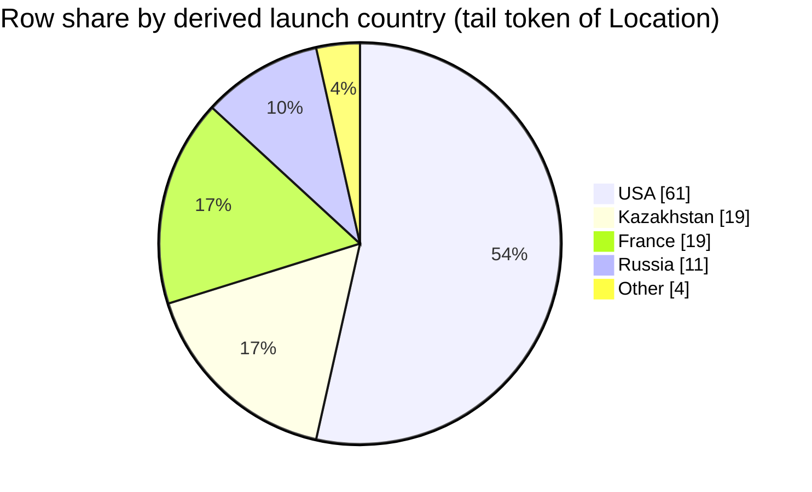

## Field selection and filters
- Fields used per row: `Location` (to derive country bucket), `Mission` (row identity), `Date` (row identity) [1][2][3][4].
- No additional filters applied: **scope = all rows present in the retrieved context blocks** [1][2][3][4].
- Country derivation rule applied consistently (verbatim): **“Treat the country as the last comma-separated segment of `Location` after trimming whitespace.”** [1][2][3][4].
- `Company` not used for country derivation (rule forbids guessing from `Company`) [1][2][3][4].
- I cannot verify the `Location` definition from `docs/applications/rag/space_missions_data_dictionary.md` because that file content is not included in the retrieved context (missing evidence) [1][2][3][4].

## Data quality and confidence
- Retrieved data is a **partial slice** of the full CSV (only certain row ranges are shown), so shares may not represent the full dataset [1][2][3][4].
- Some `Location` tails are **not countries in ordinary language** (e.g., “Barents Sea”, “Pacific Ocean”), but the rule still buckets them as tail tokens [3][4].
- Some `Location` values have **missing `Time`**, but `Location` is still present for those rows (so country bucketing is still possible) [2][4].
- No `Location` values are empty in the retrieved rows shown, so `Unparseable / missing` is not used in this slice [1][2][3][4].
- Confidence: **Medium** (mechanical parsing is clear, but the retrieved slice is incomplete and includes non-country tail tokens) [1][2][3][4].

## Country assignment examples
- `"LC-5, Cape Canaveral AFS, Florida, USA"` → **USA** [1]
- `"Site 1/5, Baikonur Cosmodrome, Kazakhstan"` → **Kazakhstan** [1]
- `"ELV-1 (SLV), Guiana Space Centre, French Guiana, France"` → **France** [2]
- `"LP Odyssey, Kiritimati Launch Area, Pacific Ocean"` → **Pacific Ocean** [3]

## Extracted table
| Country bucket | Row count | % of rows in slice |
|---|---:|---:|
| USA | 61 | 53.51% |
| Kazakhstan | 19 | 16.67% |
| France | 19 | 16.67% |
| Russia | 11 | 9.65% |
| Japan | 3 | 2.63% |
| India | 1 | 0.88% |
| Brazil | 1 | 0.88% |
| Pacific Ocean | 1 | 0.88% |
| Barents Sea | 1 | 0.88% |
| Marshall Islands | 1 | 0.88% |
| China | 1 | 0.88% |
| Iran | 1 | 0.88% |
| Israel | 1 | 0.88% |
| North Korea | 1 | 0.88% |

## Self-critique
- **Top buckets support strength:** USA **High** (many rows end with “USA”, e.g., `"…, Florida, USA"` [1]); Kazakhstan **High** (multiple rows end with “Kazakhstan”, e.g., `"…, Baikonur Cosmodrome, Kazakhstan"` [1]); France **High** (multiple rows end with “France”, e.g., `"…, French Guiana, France"` [2]).  
- **Semantic mismatch:** Buckets like **“Pacific Ocean”** and **“Barents Sea”** are tail tokens that are **water bodies, not countries**, so interpreting these percentages as “country share” is misleading even though it follows the mandated last-segment rule [3][4].
- **Totals / scope:** Counts sum to **114 rows total** and **no rows were excluded** from the denominator in this slice; however, I **cannot verify** the `Location` field definition from `docs/applications/rag/space_missions_data_dictionary.md` because it is not present in the retrieved context [1][2][3][4].
- **Retrieval bias:** The retrieved context includes specific time windows (e.g., many early-1960s rows and some 1999–2016 rows), so the distribution could differ materially from the full CSV [1][2][3][4].
- **Chart fidelity:** The pie chart below uses the **same row counts** as the table for every slice shown; because there are **14 positive-count buckets (>12)**, I roll up small buckets into **Other**, which can hide variation among those tails [1][2][3][4].
- **Other rollup risk (named):** `Other` combines **Japan, India, Brazil, Pacific Ocean, Barents Sea, Marshall Islands, China, Iran, Israel, North Korea** (each count = 1–3 in this slice) [2][3][4].

## Chart

## Summary
In the retrieved rows (n=114), the most common derived `Location` tail token is **USA (53.51%)**, followed by **Kazakhstan (16.67%)** and **France (16.67%)** [1][2][3][4]. A few tails are not countries in ordinary language (e.g., “Pacific Ocean”, “Barents Sea”), but they are still counted as buckets under the mandated parsing rule [3][4]. Because only a subset of CSV rows was retrieved, these shares may not match the full dataset distribution [1][2][3][4]. The `Location` definition from the referenced data dictionary is not available in the provided context, so I cannot confirm its intended semantics beyond what appears in the CSV rows shown [1][2][3][4].