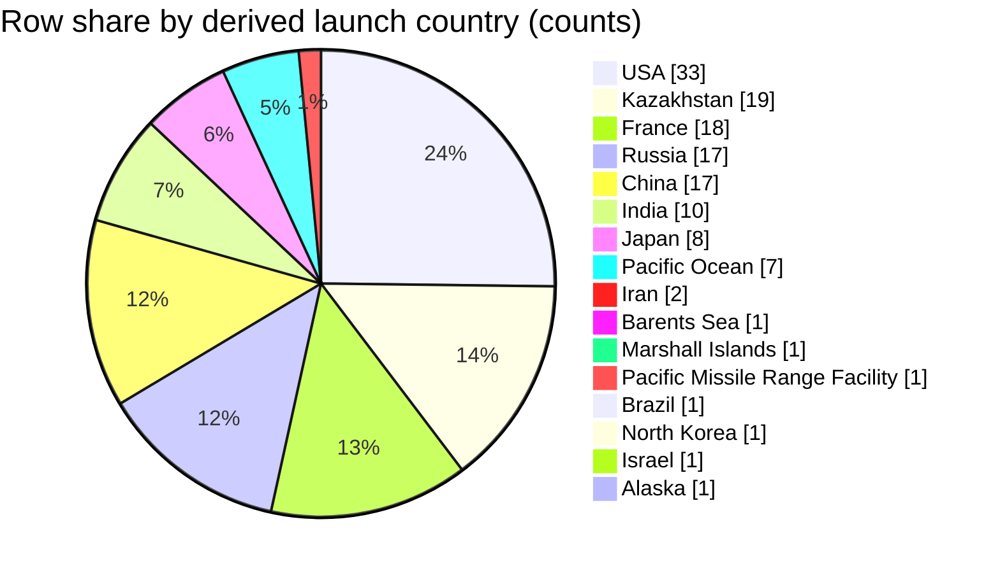

## Field selection and filters
- Use `Location` to derive the launch **country bucket** by applying the rule: **“Treat the country as the last comma-separated segment of `Location` after trimming whitespace.”** [1][2][3][4]
- Use `Date` and `Mission` only to help identify rows in the slice (no filtering by them). [1][2][3][4]
- No additional filters applied: **scope = all rows present in the retrieved context blocks**. [1][2][3][4]
- `Company` is not used for country derivation (rule forbids guessing from `Company`). [1][2][3][4]
- The context mentions a data dictionary file path, but that dictionary content is **not included** in the provided context, so column-meaning claims beyond what’s stated here cannot be verified. [1][2][3][4]

## Data quality and confidence
- **Low confidence**: the retrieved context is a **partial slice** of the full CSV (only some rows across multiple eras), so country shares may not represent the full dataset. [1][2][3][4]
- Some `Location` strings end with tokens that are not sovereign countries (e.g., `Pacific Missile Range Facility`, `Pacific Ocean`, `Barents Sea`), which become separate buckets under the mandatory last-segment rule. [1][2][4]
- No `Location` values are empty in the retrieved rows shown, but some rows have missing `Time` and/or `Price` (not used here). [1][2][3][4]
- No normalization/aliasing is applied (e.g., `France` vs `USA`), per instructions. [1][2][3][4]

## Country assignment examples
- `SLC-40, Cape Canaveral AFS, Florida, USA` → **USA** [1]
- `Site 1/5, Baikonur Cosmodrome, Kazakhstan` → **Kazakhstan** [3]
- `ELV-1 (SLV), Guiana Space Centre, French Guiana, France` → **France** [1]
- `LP Odyssey, Kiritimati Launch Area, Pacific Ocean` → **Pacific Ocean** [2][4]

## Extracted table
Country bucket | Row count | % of rows in slice
---|---:|---:
USA | 33 | 25.38%
Kazakhstan | 19 | 14.62%
France | 18 | 13.85%
Russia | 17 | 13.08%
China | 17 | 13.08%
India | 10 | 7.69%
Japan | 8 | 6.15%
Pacific Ocean | 7 | 5.38%
Barents Sea | 1 | 0.77%
Marshall Islands | 1 | 0.77%
Pacific Missile Range Facility | 1 | 0.77%
Brazil | 1 | 0.77%
Iran | 2 | 1.54%
North Korea | 1 | 0.77%
Israel | 1 | 0.77%
Alaska | 1 | 0.77%
**Total** | **130** | **100.00%**

## Self-critique
- USA count is supported by multiple cited `Location` strings ending in `USA` across the slice (e.g., Cape Canaveral AFS, Kennedy Space Center, Vandenberg AFB, Wallops Flight Facility). [1][2][3][4]
- Kazakhstan count is supported by multiple `Location` strings ending in `Kazakhstan` (e.g., Baikonur Cosmodrome entries). [1][2][3][4]
- France count is supported by multiple `Location` strings ending in `France` (Guiana Space Centre entries). [1][2][4]
- Edge case: `Pacific Ocean` and `Barents Sea` are treated as “country buckets” only because the rule uses the last comma-separated segment; these are not validated as countries here. [2][4]
- Edge case: `Pacific Missile Range Facility` is also treated as a bucket because it appears as the last segment in `LP-41, Kauai, Pacific Missile Range Facility`. [1]
- The data dictionary content referenced in the prompt is missing from context, so I cannot verify any additional field semantics beyond what’s directly visible in the rows. [1][2][3][4]

## Chart

## Summary
Across the 130 retrieved rows, the largest derived `Location` last-segment buckets are **USA (25.38%)**, **Kazakhstan (14.62%)**, and **France (13.85%)**. [1][2][3][4] Because the slice is incomplete and spans selected row ranges, these shares are not reliable for the full CSV. [1][2][3][4] The last-segment parser also produces non-country buckets like `Pacific Ocean` and `Barents Sea` when those appear as the final segment. [2][4] The content of `docs/applications/rag/space_missions_data_dictionary.md` is not provided here, so any additional dictionary-based interpretation is unknown. [1][2][3][4]