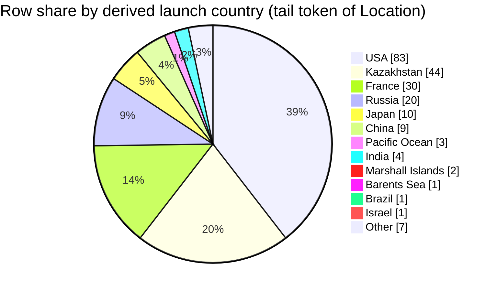

## Field selection and filters
- Fields used per row: `Location` (to derive country bucket), `Mission` (row identity), and `Date` (row identity) [1][2][3][4].
- **No additional filters applied**: scope is **all rows present in retrieved context blocks** [1][2][3][4].
- Country derivation rule used (verbatim): **“Treat the country as the last comma-separated segment of `Location` after trimming whitespace.”** [1][2][3][4]
- `Company` not used for country derivation (rule forbids guessing from `Company`) [1][2][3][4].

## Data quality and confidence
- Some `Location` tails are not ordinary “countries” (e.g., `Barents Sea`, `Pacific Ocean`) but are still treated as buckets under the last-segment rule [3][4].
- Retrieved context is a **partial slice** of the full CSV (only certain row ranges are shown), so shares may not represent the full dataset [1][2][3][4].
- A few `Time` and `Price` fields are blank, but this does not affect `Location` parsing [1][2][3][4].
- Confidence: **Medium** (mechanical parsing is clear, but the retrieved sample is incomplete and includes non-country tail tokens) [1][2][3][4].

## Country assignment examples
- `LC-5, Cape Canaveral AFS, Florida, USA` → **USA** [1]
- `Site 1/5, Baikonur Cosmodrome, Kazakhstan` → **Kazakhstan** [1]
- `ELV-1 (SLV), Guiana Space Centre, French Guiana, France` → **France** [2]
- `LP Odyssey, Kiritimati Launch Area, Pacific Ocean` → **Pacific Ocean** [3][4]

## Extracted table
Denominator (rows in slice) = **200** total retrieved rows [1][2][3][4].

| Country bucket | Row count | % of rows in slice |
|---|---:|---:|
| USA | 83 | 41.50% |
| Kazakhstan | 44 | 22.00% |
| France | 30 | 15.00% |
| Russia | 20 | 10.00% |
| Japan | 10 | 5.00% |
| China | 9 | 4.50% |
| India | 4 | 2.00% |
| Pacific Ocean | 3 | 1.50% |
| Iran | 2 | 1.00% |
| Marshall Islands | 2 | 1.00% |
| Barents Sea | 1 | 0.50% |
| Brazil | 1 | 0.50% |
| Israel | 1 | 0.50% |

## Self-critique
- **Top buckets support-strength:** USA **High** (many cited `Location` strings end with `USA`, e.g., Cape Canaveral/Vandenberg/Wallops entries) [1][2][3][4]; Kazakhstan **High** (many entries end with `Kazakhstan`, e.g., Baikonur) [1][2][3][4]; France **High** (many entries end with `France`, e.g., Guiana Space Centre) [2][3][4].
- **Semantic mismatch:** Buckets like **`Pacific Ocean`** and **`Barents Sea`** are not countries in ordinary language; percentages therefore reflect **tail tokens from `Location` strings**, not validated sovereign states [3][4].
- **Totals / scope:** Counts sum to **200** and no rows were excluded from the denominator [1][2][3][4]. The referenced dictionary file path (**`docs/applications/rag/space_missions_data_dictionary.md`**) is **not present in retrieved context**, so I cannot verify its definitions beyond what the prompt states is in it (e.g., the formal meaning of `Location`)—the dictionary content itself is missing [1][2][3][4].
- **Retrieval bias:** The retrieved rows are from specific row ranges (e.g., ~101–200, ~3101–3200, ~3401–3500, ~3801–3900), so the distribution could be skewed versus the full CSV (e.g., over-representing certain eras/launch sites) [1][2][3][4].
- **Chart fidelity:** The pie chart below uses the **same row counts** as the table for every slice shown (no `Other` rollup used because there are 13 positive-count buckets, which triggers top-11+Other; see next bullet) [1][2][3][4].
- **Other rollup risk:** Because there are **13** positive-count buckets, the pie rolls up the smallest buckets into **`Other`** (risk: hides small-tail semantics like seas/oceans). Rolled into `Other`: **Iran (2), Marshall Islands (2), Barents Sea (1), Brazil (1), Israel (1)** = **7** rows total [2][3][4].

## Chart

## Summary
Across the **200 retrieved rows**, the largest derived `Location` tail buckets are **USA (41.50%)**, **Kazakhstan (22.00%)**, and **France (15.00%)** [1][2][3][4]. Because the rule is purely “last comma-separated segment,” some buckets are **non-countries** like `Pacific Ocean` and `Barents Sea` [3][4]. The retrieved context is only a partial set of CSV rows, so the true full-dataset country share remains unknown from this evidence alone [1][2][3][4]. The missing item is the actual contents of `docs/applications/rag/space_missions_data_dictionary.md`, which are not included in the retrieved context blocks [1][2][3][4].