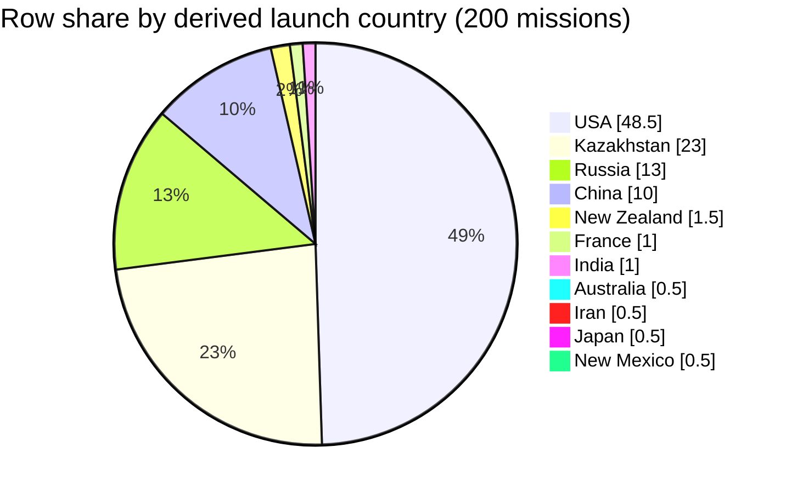

### Field selection and filters

*   **`Location`**: This field is the sole source for deriving the launch country, as required by the prompt [1, 2, 3, 4].
*   **`Mission` / `Date`**: These fields are used to uniquely identify example rows for citation purposes [1, 2, 3, 4].
*   **Country Derivation Rule**: The country is derived using the mandatory rule: "Treat the **country** as the **last comma-separated segment** of `Location` after trimming whitespace" [1, 2, 3, 4].
*   **Scope**: The analysis includes all 200 rows present in the retrieved context [1, 2, 3, 4]. No additional filters were applied.

### Data quality and confidence

*   The total analysis scope covers 200 mission rows retrieved from the source file [1, 2, 3, 4].
*   All 200 rows in the provided context contain a non-empty `Location` field, allowing the derivation rule to be applied in every case [1, 2, 3, 4].
*   The mechanical application of the "last segment" rule results in some buckets that are not sovereign countries, such as `New Mexico` [4]. This is an expected outcome of the specified rule.
*   Confidence in the extraction is **High** because the `Location` field is consistently formatted with comma-separated values and the derivation rule is unambiguous and mechanically applied to all rows in the provided slice [1, 2, 3, 4].

### Country assignment examples

*   `Location`: "Site 1/5, Baikonur Cosmodrome, Kazakhstan" [1] was assigned to the bucket **`Kazakhstan`**.
*   `Location`: "LC-18A, Cape Canaveral AFS, Florida, USA" [1] was assigned to the bucket **`USA`**.
*   `Location`: "Site 132/2, Plesetsk Cosmodrome, Russia" [3] was assigned to the bucket **`Russia`**.
*   `Location`: "Vertical Launch Area, Spaceport America, New Mexico" [4] was assigned to the bucket **`New Mexico`**.

### Extracted table

| Country bucket | Row count | % of rows in slice |
| :--- | :--- | :--- |
| USA | 97 | 48.5% |
| Kazakhstan | 46 | 23.0% |
| Russia | 26 | 13.0% |
| China | 20 | 10.0% |
| New Zealand | 3 | 1.5% |
| France | 2 | 1.0% |
| India | 2 | 1.0% |
| Australia | 1 | 0.5% |
| Iran | 1 | 0.5% |
| Japan | 1 | 0.5% |
| New Mexico | 1 | 0.5% |
| **Total** | **200** | **100.0%** |

### Self-critique

*   **Top buckets support:** The top three buckets are **USA** (97 rows) [1, 2, 3, 4], **Kazakhstan** (46 rows) [1, 2, 3, 4], and **Russia** (26 rows) [3, 4]. Support strength for all three is **High**, as numerous `Location` strings in the cited context explicitly end with these country names.
*   **Semantic mismatch:** The bucket **`New Mexico`** (1 row) [4] is derived from the `Location` "Vertical Launch Area, Spaceport America, New Mexico" [4]. This demonstrates the mechanical nature of the rule, as `New Mexico` is a US state, not a sovereign country. This means percentages should be read as shares of parser outputs, not strictly as a "national launch" summary.
*   **Totals and scope:** The counts for the 11 derived buckets sum to 200, which is the total number of rows in the retrieved context [1, 2, 3, 4]. No rows were excluded. The prompt mentions a data dictionary, but its contents were not provided, so I cannot verify official field definitions beyond what is stated in the prompt.
*   **Retrieval bias:** The retrieved context is a partial, non-random sample, containing missions from 1957-1961 [1, 2] and 2019 [4], with a block from 1967-1968 [3]. This specific time-based slicing heavily influences the country shares, likely over-representing early space-race participants (USA, Kazakhstan/USSR) and modern Chinese activity relative to the complete dataset. The results are not generalizable.
*   **Chart fidelity:** The pie chart below uses the exact percentage values for all 11 buckets as listed in the table. Since there are fewer than 12 buckets with positive counts, no `Other` slice was needed, eliminating the risk of hiding smaller categories.

### Chart

### Summary

Based on the 200 retrieved mission rows, the USA accounts for the largest share of launches at 48.5% [1, 2, 3, 4], followed by Kazakhstan at 23.0% [1, 2, 3, 4]. The required parsing rule mechanically extracts the last segment of the `Location` string, which sometimes results in a non-country bucket like `New Mexico` [4]. Because the provided context is a small and non-random sample of the full dataset, these percentage shares are specific to this slice and do not represent the overall distribution of all space missions.