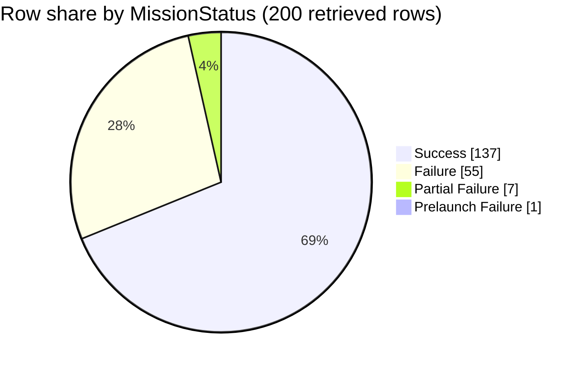

### Field selection and filters

*   **Fields used:** `MissionStatus` is the primary field for bucketing mission outcomes [1, 2, 3, 4]. `Mission` and `Date` are used to identify specific rows for examples and citation [1, 2, 3, 4].
*   **Outcome bucketing:** Each row is assigned to a bucket based on the exact string value of its `MissionStatus` field after trimming leading/trailing whitespace [1, 2, 3, 4].
*   **Scope:** All 200 rows present in the retrieved context blocks are included in the analysis [1, 2, 3, 4]. No additional filters were applied.

### Data quality and confidence

*   **Confidence:** `High` for the retrieved slice. The `MissionStatus` field is populated in all 200 retrieved rows [1, 2, 3, 4].
*   **Values observed:** The analysis found four distinct, non-empty values for `MissionStatus`: `Success`, `Failure`, `Partial Failure`, and `Prelaunch Failure` [1, 2, 3, 4]. These match the literals documented in the prompt's instructions.
*   **Missing data:** There were no rows with an empty or missing `MissionStatus` value, so the `Unnamed / missing` bucket has a count of zero [1, 2, 3, 4].
*   **Slice limitations:** The 200 retrieved rows are clustered into three distinct time periods (e.g., 1957-1961, 1967-1968, and 2019) [1, 2, 3, 4]. The resulting percentages are specific to this slice and may not accurately represent the full dataset due to this temporal bias.

### Outcome assignment examples

*   **Success:** The mission `Sputnik-1` on `1957-10-04` is assigned to the `Success` bucket based on its `MissionStatus` value of `Success` [1].
*   **Failure:** The mission `Vanguard TV3` on `1957-12-06` is assigned to the `Failure` bucket based on its `MissionStatus` value of `Failure` [1].
*   **Partial Failure:** The mission `Pioneer 1` on `1958-10-11` is assigned to the `Partial Failure` bucket based on its `MissionStatus` value of `Partial Failure` [1].
*   **Prelaunch Failure:** The mission `Nahid-1` on `2019-08-29` is assigned to the `Prelaunch Failure` bucket based on its `MissionStatus` value of `Prelaunch Failure` [4].

### Extracted table

| MissionStatus bucket | Row count | % of rows in slice |
| :--- | :--- | :--- |
| Success | 137 | 68.5% |
| Failure | 55 | 27.5% |
| Partial Failure | 7 | 3.5% |
| Prelaunch Failure | 1 | 0.5% |
| Unnamed / missing | 0 | 0.0% |
| **Total** | **200** | **100.0%** |

### Self-critique

*   **Dominant outcome (evidence depth):** The `Success` bucket is the largest, with 137 rows [1, 2, 3, 4]. Support strength is `High` for this finding within the retrieved slice, as the value is consistently present and is the most frequent outcome across all four context blocks. An example is the `Sputnik-1` mission on `1957-10-04`, which had a `MissionStatus` of `Success` [1].
*   **Rare outcomes:** The `Prelaunch Failure` category contains only one retrieved row (`Nahid-1` [4]). Its calculated share of 0.5% is therefore extremely noisy and cannot be considered a stable or reliable estimate for the full dataset.
*   **Totals / scope:** The bucket counts sum to the total number of retrieved rows (137 + 55 + 7 + 1 = 200) [1, 2, 3, 4]. The `Unnamed / missing` bucket is explicitly noted with a count of 0. The data dictionary mentioned in the prompt was not provided in the context, so the formal definitions of the `MissionStatus` values cannot be verified.
*   **Retrieval bias:** The retrieved data is heavily biased, consisting of rows clustered in the periods 1957-1961, 1967-1968, and 2019 [1, 2, 3, 4]. The high failure rate in the early space race era [1] and the high success rate in the modern 2019 data [4] indicate that the overall distribution is highly dependent on the time periods retrieved and is not representative of the entire history of space missions.
*   **Chart fidelity (numeric):** The pie chart displays slices for the four buckets with positive counts, and every positive bucket from the table appears in the pie. The chart uses the raw counts from the table, which is a valid convention. No `Other` slice was necessary.
*   **Overlap / double-count hazard:** The risk of double-counting is `Low`. The context blocks are annotated with non-overlapping row numbers from the source file (e.g., rows 1-100, 601-650, 4201-4250), indicating they are distinct slices of the dataset [1, 2, 3, 4].

### Chart

### Summary

Based on the 200 retrieved rows, `Success` is the most common mission outcome, accounting for 137 missions (68.5%) [1, 2, 3, 4]. `Failure` is the next most common outcome with 55 rows (27.5%) [1, 2, 3]. Rare outcomes like `Prelaunch Failure` are represented by a single data point (0.5%) and should be interpreted with caution [4]. These results are specific to the provided data, which is clustered in a few distinct time periods, and may not reflect the outcome distribution of the complete dataset.