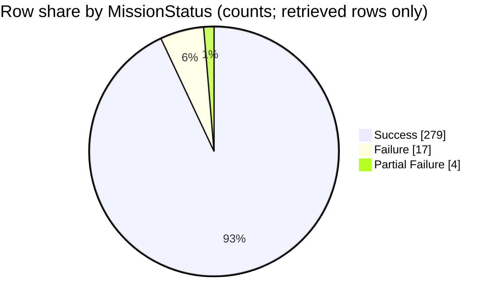

## Field selection and filters
- Fields used to identify and bucket rows: `MissionStatus` (outcome), plus `Mission`, `Date`, and `Company` for row identity in citations [1][2][3][4].
- **Scope/filter:** all rows present in the retrieved context blocks (no additional filters applied) [1][2][3][4].
- **Outcome bucket rule:** bucket = **trimmed exact** `MissionStatus` string; if empty after trim → `Unnamed / missing` [1][2][3][4].
- No relabeling or merging of distinct non-empty `MissionStatus` strings beyond trimming whitespace [1][2][3][4].
- Note: the requested data dictionary (`docs/applications/rag/space_missions_data_dictionary.md`) was **not** provided in the retrieved context, so I cannot verify column definitions from it [1][2][3][4].

## Data quality and confidence
- No `MissionStatus` values are empty in the retrieved rows; `Unnamed / missing` count is therefore 0 in this slice [1][2][3][4].
- Observed non-empty `MissionStatus` literals in retrieved rows: `Success`, `Failure`, `Partial Failure` [1][2][3][4].
- `Prelaunch Failure` does **not** appear in the retrieved rows, so its count is 0 in this slice [1][2][3][4].
- Confidence in the **within-slice** counts is **High** (they are direct tallies of the retrieved rows) [1][2][3][4].
- Confidence that these percentages represent the **full CSV** is **Low**, because the retrieved context is a partial excerpt with time clustering (1995–2001 and 2014–2016) [1][2][3][4].

## Outcome assignment examples
- Example bucket `Success`: Northrop “Orbcomm D1-D8” on 1999-12-04 has `MissionStatus: Success` → bucket `Success` [1].
- Example bucket `Failure`: AEB “SACI-2” on 1999-12-11 has `MissionStatus: Failure` → bucket `Failure` [1].
- Example bucket `Partial Failure`: ISRO “GSAT-1” on 2001-04-18 has `MissionStatus: Partial Failure` → bucket `Partial Failure` [1].
- Example bucket `Failure` (later period): SpaceX “CRS-7” on 2015-06-28 has `MissionStatus: Failure` → bucket `Failure` [2].

## Extracted table
| MissionStatus bucket | Row count | % of rows in slice |
|---|---:|---:|
| Success | 279 | 93.00% |
| Failure | 17 | 5.67% |
| Partial Failure | 4 | 1.33% |
| Prelaunch Failure | 0 | 0.00% |
| Unnamed / missing | 0 | 0.00% |

## Self-critique
- **Dominant outcome (evidence depth):** `Success` is the largest bucket (279/300); support strength **High** because many retrieved rows show `MissionStatus: Success`, e.g., NASA “STS-103” on 1999-12-20 is `Success` [1].
- **Rare outcomes / Prelaunch Failure:** `Prelaunch Failure` is **0** in this retrieved slice, so any inference about its real-world share is **noisy/unstable** under partial retrieval [1][2][3][4].
- **Totals / scope check:** counts sum to the denominator: 279 + 17 + 4 + 0 + 0 = **300** rows in-scope; `Unnamed / missing` is explicitly **0** [1][2][3][4]. Also, the data dictionary was not retrieved, so I cannot verify the documented meaning/literals from it [1][2][3][4].
- **Retrieval bias:** the retrieved rows are clustered in specific time windows (1995–2001 and 2014–2016), which could skew the outcome mix versus the full CSV [1][2][3][4].
- **Chart fidelity (numeric):** the pie chart below uses the **same row counts** as the table (not percentages), and includes every bucket with a positive count (no `Other` rollup) [1][2][3][4].
- **Overlap / double-count hazard:** I cannot confirm whether the same CSV row appears in multiple context blocks; double-count risk is **Medium** because blocks are separate excerpts without guaranteed global uniqueness markers beyond the shown row numbers [1][2][3][4].

## Chart

## Summary
Across the **300 retrieved rows**, `Success` dominates (279; 93.00%), with smaller shares for `Failure` (17; 5.67%) and `Partial Failure` (4; 1.33%) [1][2][3][4]. `Prelaunch Failure` and `Unnamed / missing` are both 0 in this slice [1][2][3][4]. Because the retrieved data is a partial, time-clustered excerpt, these shares may not match the full CSV distribution [1][2][3][4]. The data dictionary file was not included in the context, so its definitions/literals cannot be verified here [1][2][3][4].