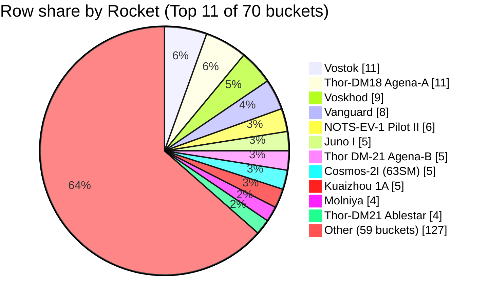

### **Field selection and filters**

*   **Fields used:** `Rocket`, `Mission`, and `Date` are used to count and identify unique mission rows [1, 2, 3, 4].
*   **Row scope:** All 200 rows retrieved across the four context blocks are included in the analysis [1, 2, 3, 4]. No filters have been applied.
*   **Bucket rule:** Each rocket bucket corresponds to the verbatim string in the `Rocket` column after trimming surrounding whitespace. Per the instructions, variants with different spelling, numbering, or punctuation are treated as distinct buckets.
*   **Missing data:** Rows with an empty or whitespace-only `Rocket` value would be assigned to an `Unnamed / missing` bucket.

### **Data quality and confidence**

*   **Confidence:** `High`. The analysis is a direct count of the values present in the 200 retrieved rows, and the bucketing rule is applied consistently.
*   **Distribution:** The data exhibits a very long-tail distribution. There are 70 distinct rocket buckets for only 200 rows [1, 2, 3, 4].
*   **Dominance:** No single rocket dominates the dataset. The two most frequent rockets, `Vostok` and `Thor-DM18 Agena-A`, each represent only 11 out of 200 rows (5.5%) [1, 2].
*   **Completeness:** No rows in the provided context had an empty `Rocket` field, so the count for `Unnamed / missing` is zero [1, 2, 3, 4].
*   **Fragmentation:** The strict bucketing rule leads to significant fragmentation. For example, `Vostok` [1, 2], `Vostok-2M` [3], `Soyuz` [3], `Soyuz FG` [4], and `Soyuz 2.1a` [4] are all counted separately, understating the share of their respective rocket families.

### **Rocket assignment examples**

*   A row with `Rocket` "Vostok", `Mission` "E-1 n†­1 (Luna-1)", and `Date` "1958-09-23" is counted in the `Vostok` bucket [1].
*   A row with `Rocket` "Voskhod", `Mission` "Cosmos 190", and `Date` "1967-11-03" is counted in the `Voskhod` bucket [3].
*   A row with `Rocket` "Falcon 9 Block 5", `Mission` "CRS-18", and `Date` "2019-07-25" is counted in the `Falcon 9 Block 5` bucket [4].
*   A row with `Rocket` "Thor-DM18 Agena-A", `Mission` "Discoverer 2", and `Date` "1959-04-13" is counted in the `Thor-DM18 Agena-A` bucket [1].

### **Extracted table**

| Rocket bucket | Row count | % of rows in slice |
| :--- | :--- | :--- |
| Vostok | 11 | 5.5% |
| Thor-DM18 Agena-A | 11 | 5.5% |
| Voskhod | 9 | 4.5% |
| Vanguard | 8 | 4.0% |
| NOTS-EV-1 Pilot II | 6 | 3.0% |
| Juno I | 5 | 2.5% |
| Thor DM-21 Agena-B | 5 | 2.5% |
| Cosmos-2I (63SM) | 5 | 2.5% |
| Kuaizhou 1A | 5 | 2.5% |
| Molniya | 4 | 2.0% |
| Thor-DM21 Ablestar | 4 | 2.0% |
| Soyuz | 4 | 2.0% |
| Titan IIIB | 4 | 2.0% |
| Falcon 9 Block 5 | 4 | 2.0% |
| Thor-DM 18 Able I | 3 | 1.5% |
| Atlas-D Able | 3 | 1.5% |
| Atlas-LV3 Agena-A | 3 | 1.5% |
| Mercury-Redstone | 3 | 1.5% |
| Cosmos-3M (11K65M) | 3 | 1.5% |
| Soyuz 2.1a | 3 | 1.5% |
| Long March 3B/E | 3 | 1.5% |
| Electron/Curie | 3 | 1.5% |
| Sputnik 8K71PS | 2 | 1.0% |
| Sputnik 8A91 | 2 | 1.0% |
| Thor DM-18 Able-II | 2 | 1.0% |
| Atlas-D Mercury | 2 | 1.0% |
| Thor DM-19 Delta | 2 | 1.0% |
| Scout X-1 | 2 | 1.0% |
| Atlas-SLV3C Centaur-D | 2 | 1.0% |
| Saturn V | 2 | 1.0% |
| Proton K/Block D | 2 | 1.0% |
| Tsyklon-2A | 2 | 1.0% |
| Molniya-M /Block L | 2 | 1.0% |
| Soyuz FG | 2 | 1.0% |
| Proton-M/Briz-M | 2 | 1.0% |
| Ariane 5 ECA | 2 | 1.0% |
| Long March 4B | 2 | 1.0% |
| Long March 3B/YZ-1 | 2 | 1.0% |
| Long March 4C | 2 | 1.0% |
| Juno II | 1 | 0.5% |
| SM-65B Atlas | 1 | 0.5% |
| Thor DM-18 Able-III | 1 | 0.5% |
| Thor DM-18 Able-IV | 1 | 0.5% |
| Tsyklon | 1 | 0.5% |
| Atlas-SLV3 Agena-D | 1 | 0.5% |
| Redstone Sparta | 1 | 0.5% |
| Cosmos-2I (63S1) | 1 | 0.5% |
| Saturn IB | 1 | 0.5% |
| Atlas-SLV3A Agena-D | 1 | 0.5% |
| Vostok-2M | 1 | 0.5% |
| Cosmos-3 (11K65) | 1 | 0.5% |
| Atlas-E/F OV1 | 1 | 0.5% |
| Proton-M/DM-3 | 1 | 0.5% |
| GSLV Mk III | 1 | 0.5% |
| Hyperbola-1 | 1 | 0.5% |
| Long March 2C | 1 | 0.5% |
| Soyuz 2.1a/Fregat-M | 1 | 0.5% |
| Atlas V 551 | 1 | 0.5% |
| Jielong-1 | 1 | 0.5% |
| Delta IV Medium+ (4,2) | 1 | 0.5% |
| Safir-1B+ | 1 | 0.5% |
| Rokot/Briz KM | 1 | 0.5% |
| Long March 11 | 1 | 0.5% |
| H-IIB | 1 | 0.5% |
| Long March 2D | 1 | 0.5% |
| Soyuz 2.1b/Fregat | 1 | 0.5% |
| Pegasus XL | 1 | 0.5% |
| SARGE | 1 | 0.5% |
| Antares 230+ | 1 | 0.5% |
| Long March 6 | 1 | 0.5% |
| Soyuz 2.1v/Volga | 1 | 0.5% |
| PSLV-XL | 1 | 0.5% |
| Unnamed / missing | 0 | 0.0% |
| **Total** | **200** | **100.0%** |

### **Self-critique**

*   **Top buckets (evidence depth):** Support for the top three buckets is `High`, as each is supported by multiple distinct rows.
    *   **Vostok (11 rows):** Example row: `Mission`: "Korabl-Sputnik 1", `Date`: 1960-05-15 [2].
    *   **Thor-DM18 Agena-A (11 rows):** Example row: `Mission`: "Discoverer 5", `Date`: 1959-08-13 [1].
    *   **Voskhod (9 rows):** Example row: `Mission`: "Cosmos 190", `Date`: 1967-11-03 [3].
*   **Label semantics:** The analysis is affected by near-duplicate vehicle strings. For instance, the `Soyuz` family is split across `Soyuz` (4 rows) [3], `Soyuz FG` (2 rows) [4], `Soyuz 2.1a` (3 rows) [4], and others. This fragmentation prevents assessing the true market share of a rocket family and makes individual bucket shares appear smaller than they might be under a canonical naming scheme.
*   **Totals / scope:** The row counts for all 70 buckets sum to 200, which is the total number of rows in the retrieved context [1, 2, 3, 4]. The `Unnamed / missing` bucket has a count of 0, as no rows had an empty `Rocket` field [1, 2, 3, 4]. The data dictionary was not provided in the context, so its definitions could not be used for verification.
*   **Retrieval bias:** The retrieved context consists of four non-contiguous 50-row chunks from 1957-1959 [1, 2], 1967-1968 [3], and 2019 [4]. This creates significant chronological bias. Early US and Soviet rockets like `Vostok` and `Vanguard` are overrepresented relative to a full dataset, while modern vehicles like `Falcon 9 Block 5` appear only in the last chunk [4]. The resulting shares are not representative of the complete dataset.
*   **Chart fidelity (numeric):** The pie chart displays the top 11 buckets by row count and groups the remaining 59 buckets into an `Other` slice [1, 2, 3, 4]. The `Other` slice's value (127) correctly equals the sum of the rolled-up bucket counts (200 total rows - 73 rows in the top 11). This rollup hides the long tail of the distribution, obscuring the diversity of rockets used. The pie chart uses row counts, consistent with the table.
*   **Overlap / double-count hazard:** The risk of double-counting is `Low`. The context is drawn from four blocks with distinct, non-overlapping source row numbers (1-50, 51-100, 601-650, and 4201-4250), indicating that the same mission row has not been retrieved twice [1, 2, 3, 4].

### **Chart**

### **Summary**

Based on the 200 retrieved mission rows, the `Vostok` and `Thor-DM18 Agena-A` rockets are the most frequent, each with 11 launches (5.5% of the slice) [1, 2]. The data is highly fragmented due to near-duplicate names being counted as distinct buckets, such as the multiple variants of the Soyuz and Long March rockets [3, 4]. These results are heavily skewed by the limited, non-contiguous time periods of the retrieved data (1950s, 1960s, and 2019) and cannot be generalized to the full history of space missions [1, 2, 3, 4]. The true distribution across the complete dataset remains unknown.