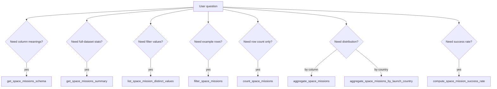

# Space Missions MCP — tool reference

**[Repository README — Documentation](../../../README.md#documentation)** · [Server guide](space-missions-mcp.md) · [Data dictionary](../rag/space_missions_data_dictionary.md)

All tools are implemented on [`SpaceMissionTools`](../../../src/SpaceMissions.McpServer/Tools/SpaceMissionTools.cs) and return a **JSON string** (camelCase property names). Errors use `{ "error": "..." }`. Successful filter operations may include `{ "warnings": [ "..." ] }` when date strings fail to parse.

## Shared filter parameters

Most tools accept the same optional slice filters (combined with **AND** logic):

| Parameter | Match type |
| --- | --- |
| `company` | Exact `Company` (case-insensitive) |
| `companyContains` | Substring on `Company` |
| `locationContains` | Substring on `Location` |
| `rocket` | Exact `Rocket` |
| `rocketContains` | Substring on `Rocket` |
| `mission` | Exact `Mission` |
| `missionContains` | Substring on `Mission` |
| `rocketStatus` | Exact `RocketStatus` |
| `missionStatus` | Exact `MissionStatus` |
| `dateFrom` | Inclusive start date (`YYYY-MM-DD`) |
| `dateTo` | Inclusive end date (`YYYY-MM-DD`) |

**Date warnings:** If `dateFrom` or `dateTo` is non-empty but not parseable, the tool adds a warning and **ignores** that bound.

**Empty filter:** Omitting all filter parameters queries the **full loaded dataset**.

## Limits (constants)

| Constant | Value | Applies to |
| --- | --- | --- |
| `DefaultLimit` | 50 | `filter_space_missions` default page size |
| `MaxLimit` | 200 | Maximum rows per `filter_space_missions` call |
| `DefaultMaxBuckets` | 50 | Default top buckets in aggregate tools |
| `MaxMaxBuckets` | 200 | Hard cap on buckets before `Other` rollup |
| `DefaultDistinctLimit` | 25 | Default values returned by distinct listing |
| `MaxDistinctLimit` | 100 | Hard cap on distinct listing |

---

## `get_space_missions_schema`

**Purpose:** Column metadata plus dataset scale hints for planning queries.

**Parameters:** None.

**Response (example shape):**

```json
{
  "columns": [{ "name": "Company", "description": "..." }],
  "datasetRowCount": 4630,
  "dateRange": { "min": "1957-10-04", "max": "2022-08-31" },
  "knownMissionStatusValues": [
    "Success",
    "Failure",
    "Partial Failure",
    "Prelaunch Failure"
  ]
}
```

**Notes:** `RocketStatus` in the CSV is typically **`Retired`** or **`Active`** (snapshot as of August 2022), not a generic Active/Inactive pair.

---

## `get_space_missions_summary`

**Purpose:** One-shot overview of the **entire** loaded dataset (no slice filters).

**Parameters:** None.

**Response:**

```json
{
  "totalRows": 4630,
  "dateMin": "1957-10-04",
  "dateMax": "2022-08-31",
  "missionStatusBreakdown": [
    { "bucket": "Success", "count": 4162, "percentage": 89.89 }
  ]
}
```

Each breakdown entry is an `AggregateBucket` (`bucket`, `count`, `percentage`).

---

## `list_space_mission_distinct_values`

**Purpose:** Discover categorical values before exact-match filters.

| Parameter | Required | Description |
| --- | --- | --- |
| `column` | Yes | One of: `Company`, `Location`, `Date`, `Time`, `Rocket`, `Mission`, `RocketStatus`, `Price`, `MissionStatus` |
| `search` | No | Substring filter on distinct values (after trim) |
| `limit` | No | Default 25, max 100 |
| *(shared filters)* | No | Restrict the row set before computing distinct values |

**Response:**

```json
{
  "column": "Company",
  "totalDistinct": 42,
  "returned": 25,
  "values": ["AMBA", "ESA", "NASA", "SpaceX"],
  "warnings": []
}
```

**Errors:** Invalid `column` → `{ "error": "Invalid column '...'." }`.

---

## `filter_space_missions`

**Purpose:** Return **row-level** evidence for grounded answers.

| Parameter | Default | Description |
| --- | --- | --- |
| `limit` | 50 | Page size (max 200) |
| `offset` | 0 | Skip rows after stable sort |
| *(shared filters)* | — | Slice before paging |

**Sort order:** `Date` ascending, then `Time`, then `Mission` (ordinal string compare).

**Response:**

```json
{
  "returned": 5,
  "totalMatching": 5,
  "limit": 50,
  "offset": 0,
  "warnings": [],
  "rows": [
    {
      "company": "SpaceX",
      "location": "LC-39A, Kennedy Space Center, Florida, USA",
      "date": "2020-05-30",
      "time": "19:22:00",
      "rocket": "Falcon 9",
      "mission": "Demo-2",
      "rocketStatus": "Active",
      "price": "62",
      "missionStatus": "Success"
    }
  ]
}
```

**Agent note:** When `returned` < `totalMatching`, disclose partial retrieval and paginate with `offset` if more rows are needed.

---

## `count_space_missions`

**Purpose:** Count rows in the filtered slice without returning row bodies.

**Parameters:** Shared filters only.

**Response:**

```json
{
  "count": 1234,
  "warnings": []
}
```

---

## `aggregate_space_missions`

**Purpose:** Group-by counts and percentages on a dataset column.

| Parameter | Required | Description |
| --- | --- | --- |
| `groupBy` | Yes | `Company`, `Location`, `Date`, `Time`, `Rocket`, `Mission`, `RocketStatus`, `Price`, or `MissionStatus` |
| `maxBuckets` | No | Default 50; excess groups roll into `other` |
| *(shared filters)* | No | Slice before grouping |

**Response:**

```json
{
  "groupByColumn": "MissionStatus",
  "totalRows": 200,
  "buckets": [
    { "bucket": "Success", "count": 137, "percentage": 68.5 }
  ],
  "other": { "bucket": "Other", "count": 12, "percentage": 6.0 },
  "warnings": []
}
```

`other` is omitted (null) when bucket count ≤ `maxBuckets`.

**Errors:** Missing `groupBy` or invalid column name → `{ "error": "..." }`.

---

## `aggregate_space_missions_by_launch_country`

**Purpose:** Geography breakdown using the RAG **last comma-separated segment** rule on `Location`.

| Parameter | Default | Description |
| --- | --- | --- |
| `maxBuckets` | 50 | Top countries; remainder in `other` |
| *(shared filters)* | — | Slice before grouping |

**Derivation rule** (also returned as `derivationRule`):

> Country is the last comma-separated segment of `Location` after trimming whitespace; empty `Location` yields **`Unparseable / missing`**.

**Response:**

```json
{
  "groupByColumn": "LaunchCountry",
  "derivationRule": "Country is the last comma-separated segment...",
  "totalRows": 200,
  "buckets": [
    { "bucket": "USA", "count": 80, "percentage": 40.0 }
  ],
  "other": null,
  "warnings": []
}
```

Implementation: [`LaunchCountryParser`](../../../src/PromptEngineering.SpaceMissions/LaunchCountryParser.cs).

**Caveats for agents:** Last-segment tokens may be US states, site names, or oceans—not always sovereign countries. Label results as **parser outputs**, not validated geography.

---

## `compute_space_mission_success_rate`

**Purpose:** Mission success rate for a filtered slice.

**Formula** (returned as `formula`):

```text
successRate = count(MissionStatus == 'Success') / count(non-empty MissionStatus)
```

Percentages use only the **filtered slice**. Rows with empty `MissionStatus` are excluded from the denominator.

**Parameters:** Shared filters only.

**Response:**

```json
{
  "totalMatching": 100,
  "successCount": 85,
  "denominator": 100,
  "successRatePercent": 85.0,
  "formula": "successRate = count(MissionStatus == 'Success') / count(non-empty MissionStatus); ...",
  "warnings": []
}
```

---

## Tool selection flow (for hosts)



## See also

- [Server guide](space-missions-mcp.md) — architecture, configuration, Chatbot wiring
- [RAG eval gold](../rag/rag_eval_space_missions_gold.md) — eval-004 (launch country) and related checks
