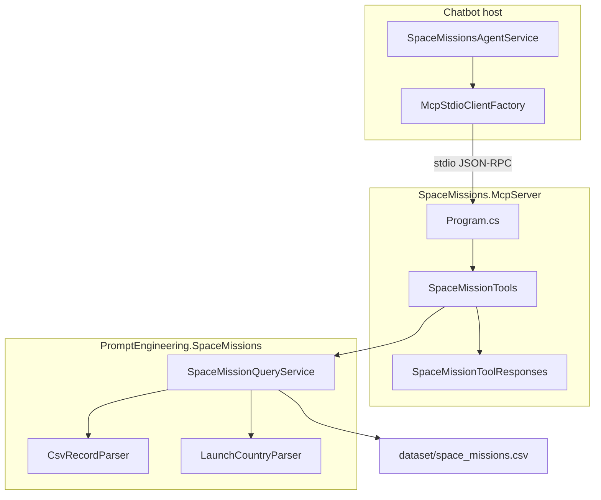

# Space Missions MCP Server

**[Repository README — Documentation](../../../README.md#documentation)** · [Tool reference](space-missions-mcp-tools.md) · [Space missions data dictionary](../rag/space_missions_data_dictionary.md)

The **`SpaceMissions.McpServer`** project exposes **eight** [Model Context Protocol (MCP)](https://modelcontextprotocol.io/) tools over **stdio**. Each tool runs **deterministic queries** against **`dataset/space_missions.csv`** (loaded once at process start). Hosts such as **`Chatbot`** spawn this process, map tool definitions into the LLM function-calling API, and pass **real** tool results back to the model—**do not** fabricate counts, rows, or aggregates in prompts when this server is connected.

## Role in the repository

| Access pattern | Project | How the model gets data |
| --- | --- | --- |
| **Retrieval (RAG)** | `Rag` | Embeds chunks of **one** corpus file; answers must cite retrieved context. |
| **Tool calling (MCP)** | `SpaceMissions.McpServer` + `Chatbot` | Model calls tools; host returns JSON from in-memory CSV queries. |
| **ReAct (no tools)** | `PromptEngineering.Client` | Rows injected as XML `<record>` in the user message. |

All three can target the **same** CSV. Field meanings are documented in **[`space_missions_data_dictionary.md`](../rag/space_missions_data_dictionary.md)**. RAG eval questions under **`questions/question_space_missions_*.md`** (for example launch-country share) align with tools such as **`aggregate_space_missions_by_launch_country`** and **`compute_space_mission_success_rate`**.

## Architecture



| Component | Path | Responsibility |
| --- | --- | --- |
| MCP host process | [`src/SpaceMissions.McpServer/`](../../../src/SpaceMissions.McpServer/) | `AddMcpServer()`, stdio transport, register `SpaceMissionTools`. |
| Tool adapters | [`Tools/SpaceMissionTools.cs`](../../../src/SpaceMissions.McpServer/Tools/SpaceMissionTools.cs) | MCP attributes, parameter descriptions, JSON envelopes. |
| Shared filter/JSON | [`Tools/SpaceMissionToolResponses.cs`](../../../src/SpaceMissions.McpServer/Tools/SpaceMissionToolResponses.cs) | camelCase serialization, date validation **warnings**. |
| Query engine | [`src/PromptEngineering.SpaceMissions/`](../../../src/PromptEngineering.SpaceMissions/) | Load CSV, filter, aggregate, distinct values, success rate, launch-country derivation. |
| Chatbot integration | [`src/Chatbot/`](../../../src/Chatbot/) | Resolve paths, spawn MCP, tool loop via `SpaceMissionsMcpAgentService`. |

Business logic stays in **`PromptEngineering.SpaceMissions`** so unit tests do not require a live MCP session. MCP tests in **`tests/SpaceMissions.McpServer.Tests`** assert JSON contracts; **`tests/Chatbot.Tests`** can list tools over stdio when the server is built.

## Dataset

| Item | Default |
| --- | --- |
| File | **`dataset/space_missions.csv`** (~4.6k rows) |
| Override | Environment variable **`SPACE_MISSIONS_DATASET_PATH`** (absolute or relative path resolved at startup) |
| Columns | `Company`, `Location`, `Date`, `Time`, `Rocket`, `Mission`, `RocketStatus`, `Price`, `MissionStatus` |

The server reads the file **once** when `SpaceMissionQueryService` is constructed. Changing the CSV on disk requires **restarting** the MCP process.

## Transport and packages

- **Transport:** MCP **stdio** only (no HTTP listener in this project).
- **SDK:** [`ModelContextProtocol`](https://www.nuget.org/packages/ModelContextProtocol) 1.x on **.NET 8**.
- **Hosting:** `Microsoft.Extensions.Hosting` generic host; logs go to **stderr** so stdout stays clean for the protocol.

Entry point: [`Program.cs`](../../../src/SpaceMissions.McpServer/Program.cs).

```csharp
// Dataset path: env var or default
const string DatasetPathEnv = "SPACE_MISSIONS_DATASET_PATH";
const string DefaultDatasetPath = "dataset/space_missions.csv";

builder.Services.AddSingleton<ISpaceMissionQueryService>(_ => new SpaceMissionQueryService(datasetPath));
builder.Services
    .AddMcpServer()
    .WithStdioServerTransport()
    .WithTools<SpaceMissionTools>();
```

## Tool surface (summary)

Eight tools are registered on `SpaceMissionTools`. Full parameters, response shapes, and agent guidance: **[Tool reference](space-missions-mcp-tools.md)**.

| Tool | Use when |
| --- | --- |
| `get_space_missions_schema` | Column definitions, row count, date range, known `MissionStatus` literals. |
| `get_space_missions_summary` | Full-dataset overview and outcome mix without filters. |
| `list_space_mission_distinct_values` | Discover exact filter values (companies, statuses, …). |
| `filter_space_missions` | Return row-level evidence (paginated, max 200 per call). |
| `count_space_missions` | Count matching rows only. |
| `aggregate_space_missions` | Group-by counts and percentages on any column. |
| `aggregate_space_missions_by_launch_country` | Country share using the **last comma segment** of `Location`. |
| `compute_space_mission_success_rate` | `Success` / non-empty `MissionStatus` rate for a filtered slice. |

Responses use **camelCase** JSON. Invalid `dateFrom` / `dateTo` strings produce **`warnings`** and are **not** applied to the filter.

## Configuration

### Standalone MCP server

| Mechanism | Key / variable | Role |
| --- | --- | --- |
| Environment | `SPACE_MISSIONS_DATASET_PATH` | CSV path when not using Chatbot path resolution. |
| Working directory | Process CWD | Relative default `dataset/space_missions.csv` resolves from CWD when run alone. |

Example (repository root):

```powershell
$env:SPACE_MISSIONS_DATASET_PATH = "dataset/space_missions.csv"
dotnet run --project src/SpaceMissions.McpServer/SpaceMissions.McpServer.csproj
```

The process blocks on stdio; use an MCP client or the Chatbot host to exercise tools.

### Chatbot host (`SpaceMissionsAgent` section)

[`src/Chatbot/appsettings.json`](../../../src/Chatbot/appsettings.json) configures the agent that **spawns** the MCP server:

| Key | Role |
| --- | --- |
| `SpaceMissionsAgent:InstanceName` | LLM instance (`Instances[].Name` in `SystemSettings:AiServiceSettings`). |
| `SpaceMissionsAgent:Temperature` | Chat temperature. |
| `SpaceMissionsAgent:MaxFunctionIterations` | Cap on tool-call rounds per user message. |
| `SpaceMissionsAgent:McpProjectPath` | Path to `.csproj`, built `.dll`, or executable (see launch resolution below). |
| `SpaceMissionsAgent:DatasetPath` | Repo-relative path to `space_missions.csv`. |
| `SpaceMissionsAgent:RepoRoot` | Optional override when auto-discovery fails. |
| `SpaceMissionsAgent:SpaceMissionsMcp` | `McpTransportOptions` (`Name`, optional `Command` / `Arguments` / `WorkingDirectory` overrides). |

At startup, [`SpaceMissionsPathResolver`](../../../src/Chatbot/SpaceMissionsPathResolver.cs):

1. Finds the repository root (walks up until `dataset/space_missions.csv` exists).
2. Resolves the MCP launch target in order: **bundled** `mcp-server/SpaceMissions.McpServer.dll` under the Chatbot output folder → **Debug/Release** build under `src/SpaceMissions.McpServer/bin/` → **`dotnet run --project`** on `McpProjectPath`.
3. Sets **`SPACE_MISSIONS_DATASET_PATH`** on the MCP child process environment to the absolute dataset path.

System prompt (tool routing hints): [`SpaceMissionsAgentService.cs`](../../../src/Chatbot/Services/SpaceMissionsAgentService.cs).

## Run: Chatbot with Space Missions MCP

Prerequisites: **.NET 8**, LLM API keys (user secrets), and a built MCP server (or bundled copy after Chatbot publish).

```powershell
# From repository root — API + bot secrets (see Getting started)
dotnet user-secrets set "SystemSettings:AiServiceSettings:BaseAddress" "https://..." `
  --project src/Chatbot/Chatbot.csproj
dotnet user-secrets set "SystemSettings:AiServiceSettings:Instances:2:ApiKey" "your-key" `
  --project src/Chatbot/Chatbot.csproj

dotnet build src/Chatbot/Chatbot.csproj
dotnet run --project src/Chatbot/Chatbot.csproj
```

For **M365 Agents Playground**, point the tester at the bot endpoint (for example `http://127.0.0.1:5130/api/messages`) after the app is listening. Bot registration secrets are separate from the LLM keys—see **[Getting started](../../getting-started.md#user-secrets)**.

Example user questions that should invoke tools (not invented numbers):

- “How many SpaceX launches are in the dataset?” → `count_space_missions` or `get_space_missions_summary` + filter.
- “What is the success rate for SpaceX missions since 2020?” → `compute_space_mission_success_rate` with `company` / `dateFrom`.
- “What share of rows launch from USA?” → `aggregate_space_missions_by_launch_country`.

## Agent behavior and evidence rules

Aligned with [`.cursor/rules/project-rules.mdc`](../../../.cursor/rules/project-rules.mdc) **Agent** mode:

- Tool **observations** are authoritative for counts, percentages, and row facts.
- If **`filter_space_missions`** returns fewer rows than **`totalMatching`**, state that the answer is based on a **partial page** (limit 200, use `offset`).
- If **`aggregate_space_missions`** returns an **`other`** bucket, mention **rollup** when interpreting tail distributions.
- Prefer **`list_space_mission_distinct_values`** before exact-match filters when the user’s label may not match CSV spelling.
- Do **not** merge company or rocket name variants unless the user explicitly asks for canonicalization (RAG prompts forbid this by default).

## Tests

```powershell
dotnet test tests/PromptEngineering.SpaceMissions.Tests/PromptEngineering.SpaceMissions.Tests.csproj
dotnet test tests/SpaceMissions.McpServer.Tests/SpaceMissions.McpServer.Tests.csproj
dotnet test tests/Chatbot.Tests/Chatbot.Tests.csproj --filter "FullyQualifiedName~SpaceMissions"
```

Fixtures: **`tests/*/Fixtures/space_missions_sample.csv`** (20 rows).

## Related documentation

| Document | Topics |
| --- | --- |
| [Tool reference](space-missions-mcp-tools.md) | All eight tools, filters, limits, JSON examples |
| [Sample user questions](mcp-questions.md) | 69 prompts mapped to tools (smoke / eval) |
| [Space missions data dictionary](../rag/space_missions_data_dictionary.md) | Column semantics |
| [RAG guide](../rag/rag.md) | Chunked retrieval over the same CSV |
| [RAG eval gold](../rag/rag_eval_space_missions_gold.md) | Scoring prefilled space-missions questions |
| [Getting started](../../getting-started.md) | Chatbot user secrets and run commands |
| [Overview](../../overview.md) | How this track fits beside RAG and Agent |

## See also

- [`src/PromptEngineering.Mcp/`](../../../src/PromptEngineering.Mcp/) — shared stdio MCP client factory used by **Agent** and **Chatbot**.
- [`src/Agent/`](../../../src/Agent/) — external MCP servers (Open-Meteo, DuckDuckGo) via **Node.js** / **`npx`**.
