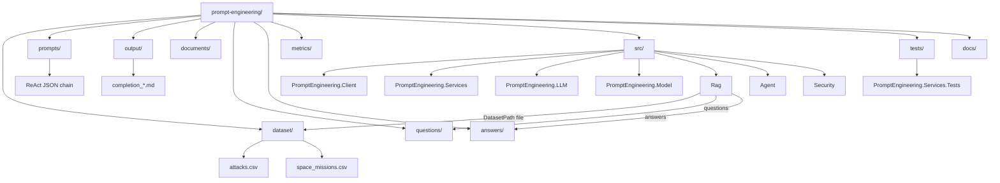

# Repository structure

**[Repository README — Documentation](../README.md#documentation)** · [Overview](overview.md)

## Top-level layout

| Path | Role |
| --- | --- |
| `dataset/attacks.csv` | Source data for **PromptEngineering.Client** (shark attacks) |
| `dataset/space_missions.csv` | Tabular sample file for **Rag** when **`Rag:DatasetPath`** points at it |
| `prompts/*.json` | Prompt definitions and **`ReActSequence`** (Client) |
| `output/` | Default Client completion output (`completion_<stem>_<timestamp>.md`) |
| `documents/` | Optional extra files; use as **`Rag:DatasetPath`** target if you keep a corpus here |
| `questions/` | RAG prefilled prompts (`*.md`) — **`DocumentsFolderPath`** + **`QuestionsPath`** |
| `answers/` | RAG saved answers — **`DocumentsFolderPath`** + **`AnswersPath`** |
| `metrics/` | Offline scoring specs (**`answer_correctness_score.md`**, **`agent_tool_routing_accuracy.md`**, …); **not** indexed by Rag unless copied into the **`DatasetPath`** file |
| `risk-assessment/` | Narrative risk notes (**prompt injection**, **sensitive information disclosure**) aligned with the **`Security`** console demos |
| `src/` | .NET projects ([solution](../src/PromptEngineering.sln)) |
| `tests/` | Unit tests (e.g. **`PromptEngineering.Services.Tests`**) |
| **`docs/`** | Common guides plus **`docs/applications/`** (**prompt-engineering**, **rag**, **agent**, **security**) — full index: [README.md](../README.md#documentation) |

## Solution projects

| Project | Role |
| --- | --- |
| `PromptEngineering.Client` | Console: load CSV, run **`ReActSequence`**, write outputs |
| `PromptEngineering.Services` | Orchestration (**`ContextService`**, pipeline) |
| `PromptEngineering.LLM` | HTTP integration: chat, embeddings, settings models |
| `PromptEngineering.Model` | Shared domain types |
| `Rag` | Console: single-file index, retrieve, answer |
| `Agent` | Console: MCP tool-using chat — **`src/Agent/appsettings.json`** |
| `Security` | Console: paired **vulnerable / mitigated** chat demos (**prompt injection**, **sensitive disclosure**) — **`src/Security/`**, [Security samples](applications/security/security-samples.md) |
| `PromptEngineering.Services.Tests` | Service tests |

## RAG paths (mental model)

| Item | Role |
| --- | --- |
| **`Rag:DocumentsFolderPath`** | Anchor for **`DatasetPath`**, **`QuestionsPath`**, **`AnswersPath`** when those values are relative |
| **`Rag:DatasetPath`** | **One** indexed **`.md`**, **`.txt`**, or **`.csv`** (committed default: **`dataset/space_missions.csv`**) |
| **`questions/`**, **`answers/`** | Sibling folders under repo root by default; resolved via **`DocumentsFolderPath`** |

Offline RAG eval: **[`applications/rag/rag_eval_space_missions_gold.md`](applications/rag/rag_eval_space_missions_gold.md)**. Agent TRA sample: **[`applications/agent/agent-weather-news.md`](applications/agent/agent-weather-news.md)**. Security demos: **[`applications/security/security-samples.md`](applications/security/security-samples.md)**.

## Diagram

