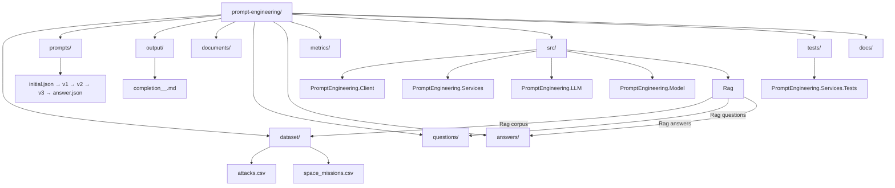

# Repository structure

## Top-level layout

| Path | Role |
| --- | --- |
| `dataset/attacks.csv` | Source data for the ReAct client (shark attacks) |
| `dataset/space_missions.csv` | Tabular sample for the **Rag** index (space launches); indexed when **`Rag:DocumentsPath`** is **`dataset`** |
| `prompts/*.json` | Prompt definitions and `ReActSequence` order (referenced by Client config) |
| `output/` | Default target for saved LLM completions from the Client |
| `documents/` | Optional extra RAG corpus (`.md`, `.txt`, `.csv`); empty by default—set **`Rag:DocumentsPath`** to **`documents`** if you add files here |
| `questions/` | RAG prefilled prompts (`*.md`); resolved as **`Rag:DocumentsFolderPath`** + **`Rag:QuestionsPath`** |
| `answers/` | RAG saved answers from prefilled/manual runs; resolved as **`Rag:DocumentsFolderPath`** + **`Rag:AnswersPath`** |
| `metrics/` | RAG metric specs and offline eval gold; not indexed unless also under **`dataset/`** / **`documents/`** (or a custom **`DocumentsPath`**) |
| `src/` | .NET projects (see below) |
| `tests/` | Unit tests (e.g. `ContextService`) |
| `docs/` | This documentation set |

## Solution projects

| Project | Role |
| --- | --- |
| `PromptEngineering.Client` | Console host: load CSV, run `ReActSequence`, write outputs |
| `PromptEngineering.Services` | Orchestration (`ContextService`, pipeline) |
| `PromptEngineering.LLM` | HTTP integration: chat, embeddings, shared settings models |
| `PromptEngineering.Model` | Shared domain types |
| `Rag` | Console host: chunk documents, embed, retrieve, answer |
| `PromptEngineering.Services.Tests` | Tests for services |

## RAG assets and `Rag` project

| Path | Role |
| --- | --- |
| **`dataset/`** (default **`Rag:DocumentsPath`**) | Committed **`space_missions.csv`** (and **`attacks.csv`**) live here; **Rag** indexes all matching extensions under this folder unless you change config. |
| **`documents/`**, **`questions/`**, **`answers/`** | **`questions/`** and **`answers/`** are always under repo root. **`documents/`** is optional corpus; default indexing targets **`dataset/`** instead. |
| **`Rag:DocumentsFolderPath`** + paths | Resolve corpus/questions/answers (see **`docs/rag.md`**). Not copied into `bin`. |
| **`metrics/`** | Documentation and gold eval CSV only; add or copy files into **`dataset/`** (or **`documents/`**) if they must be retrieved. |

## Diagram

