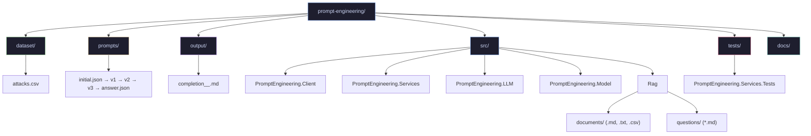

# Repository structure

## Top-level layout

| Path | Role |
| --- | --- |
| `dataset/attacks.csv` | Source data for the ReAct client (shark attacks) |
| `prompts/*.json` | Prompt definitions and `ReActSequence` order (referenced by Client config) |
| `output/` | Default target for saved LLM completions from the Client |
| `src/` | .NET projects (see below) |
| `tests/` | Unit tests (e.g. `ContextService`) |
| `docs/` | This documentation set |

## Solution projects

| Project | Role |
| --- | --- |
| `PromptEngineering.Client` | Console host: load CSV, run `ReActSequence`, write outputs |
| `PromptEngineering.Services` | Orchestration (`ContextService`, pipeline) |
| `PromptEngineering.LLM` | HTTP integration: chat, embeddings, shared settings models |
| `PromptEngineering.Model` | Shared domain types |
| `Rag` | Console host: chunk documents, embed, retrieve, answer |
| `PromptEngineering.Services.Tests` | Tests for services |

## RAG assets (`Rag` project)

| Path (source) | Build / runtime |
| --- | --- |
| **`src/Rag/documents/`** | Copied to output as **`documents/**`** — indexed corpus (`.md`, `.txt`, `.csv`). |
| **`src/Rag/questions/`** | Copied to output as **`questions/**`** — prefilled prompts (`*.md`) for batch runs. |
| **`src/Rag/answers/`** | Created at runtime next to the executable (default **`answers/`**) — model outputs from prefilled or manual mode. |
| **`src/Rag/metrics/`** | Specs and gold eval CSV only; **not** in `Content` copy items — add files to **`documents/`** if they must be retrieved. |

## Diagram

