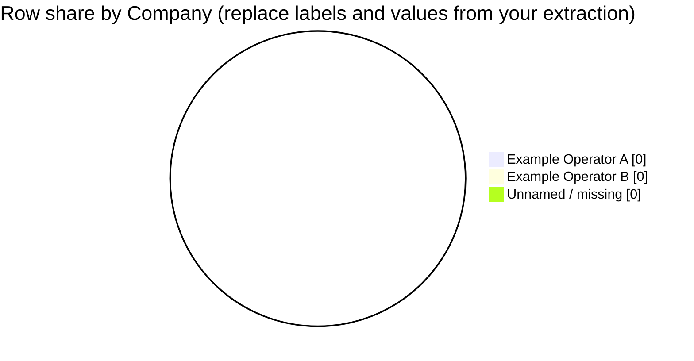

# Business question: company (operator) row share from `Company` — table and pie

## Context and data

Act as a **space launch operations analyst**. Ground every number in **retrieved rows** from `dataset/space_missions.csv`, using column meanings from **`docs/applications/rag/space_missions_data_dictionary.md`**.

The CSV header for the operator / organization field is **`Company`**. Throughout this prompt, **company name** means the **verbatim value of that column** for each row (informally you may think of it as the mission’s **company name** field). There is **no** separate `CompanyName` column—do **not** invent one.

The dictionary describes **`Company`** as the organization responsible for the mission; use **exact string equality** on the values you see (after **trimming surrounding whitespace only**). Do **not** merge labels (for example treating subsidiaries as one parent) unless you apply one documented rule to **every** row and label confidence.

**Scope:** All rows present in **retrieved context** unless the user-facing question below adds a filter.

## Company bucket rule (mandatory)

- **Default:** Bucket = **trimmed** `Company` string. Empty after trim → **`Unnamed / missing`**.
- **No external canonicalization:** Do not rename companies using outside knowledge; spelling and punctuation differences create **distinct** buckets.
- **Row identity:** Use **`Mission`** and/or **`Date`** (and optionally **`Location`**) so counted rows are identifiable in citations.

## Self-critique themes (required content)

The **Self-critique** bullets (max **6**) **must collectively cover** all of the following. Use **up to six bullets**; you may **merge** related points only when a single bullet stays easy to score (for example retrieval bias + temporal clustering in one bullet).

1. **Top buckets (evidence depth)** — For each of the **three largest** `Company` buckets by row count: (a) assign **support strength** `High` / `Medium` / `Low` with a **one-clause** rationale; (b) cite **at least one concrete retrieved row** for that bucket naming **`Company`** plus **`Mission`** and **`Date`** (or explain if either is missing in context). *Do not collapse all three operators into a single vague “many rows” claim without at least one named example per bucket.*
2. **Label semantics** — At least one bullet on **duplicate-looking operators** (near-duplicate strings, abbreviations vs full names, historically related labels such as different strings for the same national program) and how that affects reading shares as “one company per bucket.”
3. **Totals / scope** — State that **all bucket counts sum** to your stated slice denominator (or show the arithmetic); note **`Unnamed / missing`** explicitly (even when count is **0**); if the dictionary was **not** retrieved, state what you **cannot** verify from it.
4. **Retrieval bias** — Whether **partial retrieval**, **chunk boundaries**, or **time clustering** in the retrieved rows could skew which operators rank largest versus the full CSV.
5. **Chart fidelity (numeric)** — Confirm the **pie** uses the **same convention** (counts or percentages) as the table for displayed slices. If **`Other`** is used: (a) the **`Other`** slice must **equal the sum** of the per-bucket counts you list as rolled up (or equal that sum as a percentage of the same denominator); (b) name **rollup risk** (long-tail operators hidden). If **`Other`** is not used, state that every positive bucket appears in the pie.
6. **Overlap / double-count hazard** — State whether the retrieved context could contain the **same mission row twice** across chunks; if yes, how you avoided double-counting; if you cannot tell, label **double-count risk** as `Low` / `Medium` / `High` and why.

## Task outcomes (numbered)

1. **Select fields** — Use at least **`Company`**, **`Mission`** (or **`Date`**), and **`Location`** if useful for row identity; justify extra filters only if asked or visible in context (max **6** bullets in the section).
2. **Data quality** — Note empty `Company`, very small retrieved slices, or dominant single-operator slices before trusting percentages; state confidence (`High` / `Medium` / `Low`) (max **6** bullets).
3. **Extract** — From **retrieved context only**, count rows per **company bucket** and **percentage of rows** in the slice. Denominator = **all rows in scope** (including **`Unnamed / missing`** unless you define a smaller denominator and justify it).
4. **Self-critique** — **At most 6** bullets satisfying **Self-critique themes (required content)** above (including **per-top-3 example rows**, **sum checks**, **`Other` arithmetic**, and **overlap hazard**).
5. **Revise** — Soften unsupported shares; if fewer than **two** buckets have positive counts, **omit** the pie and explain why (still provide the table if rows exist).
6. **Visualize** — **One** Mermaid **pie** using the **same** counts or **percentages** as the table. **Positive** slices only; **zero** buckets omitted from the pie and listed in prose. If **more than 12** buckets have positive counts, pie = **top 11** by count plus **`Other`**; list which labels roll into **`Other`**; the **Extracted table** lists **every** bucket.

## Mermaid pie chart (syntax)

Use a fenced code block with language `mermaid`. Optional: `showData` and `title`. Quote labels that contain commas or special characters.

(Replace with values from **provided records only**, subject to the **top 11 + Other** rule.)

## Strict output sections

Return exactly these sections, **in order**:

- **Field selection and filters** — Bullet list (max **6** bullets); must state the **trimmed exact `Company` string** bucket rule.
- **Data quality and confidence** — Bullet list (max **6** bullets).
- **Company assignment examples** — Bullet list (max **4** bullets): **up to four** distinct rows (cite `Company` plus `Mission` or `Date`) showing how bucketing works.
- **Extracted table** — Markdown table: `Company bucket`, `Row count`, `% of rows in slice` (or “not computable”).
- **Self-critique** — Bullet list (max **6** bullets); cover **every** theme in **Self-critique themes (required content)** (top-3 example rows, label semantics, totals/`Unnamed`/dictionary, retrieval bias, pie–table/`Other` math, overlap hazard).
- **Chart** — One `mermaid` pie block or a one-line omission statement.
- **Summary** — At most **4** sentences: what the evidence shows, label-merge caveats, what remains unknown for the full CSV.

**Rules:** No fabricated counts; no invented `Company` values; if evidence is partial, say so; do not treat this file as indexed unless your answer can draw from the configured **`Rag:DatasetPath`** corpus (resolved under **`DocumentsFolderPath`**).

## Question (user-facing)

Using only **retrieved** rows from the space missions data, what **share of missions (rows)** does each **company name** (`Company` column) represent in the slice? Return **counts and percentages in a table** and the **same** distribution in a **single Mermaid pie chart**.
