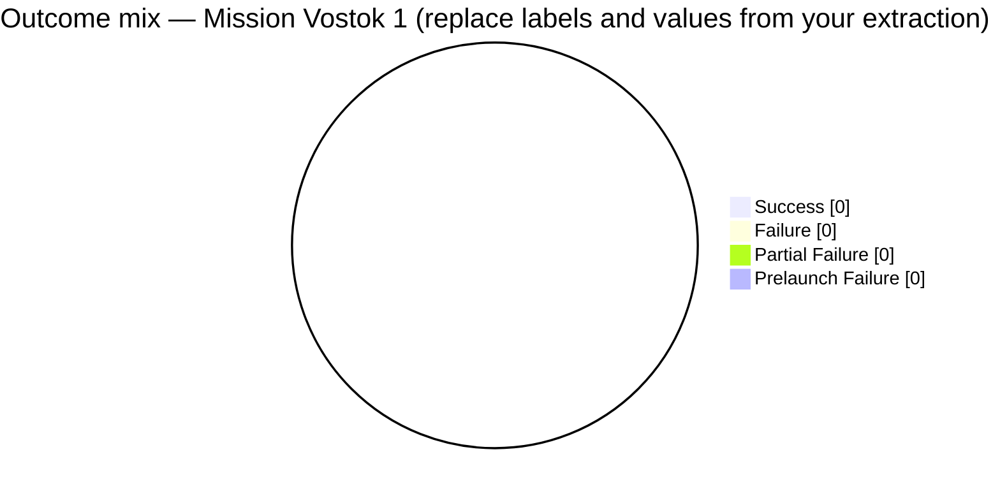

# Business question: Vostok 1 — mission outcome extraction and pie visualization

## Context and data

Act as a **space launch outcomes analyst**. Ground every number in **retrieved rows** from `dataset/space_missions.csv`, using column meanings from `metrics/space_missions_data_dictionary.md`. For outcome shares, align category labels with **`MissionStatus`**: `Success`, `Failure`, `Partial Failure`, `Prelaunch Failure` (exact strings as in the data).

**Scope — Vostok 1 mission:** Restrict the analysis to missions where **`Mission` equals exactly `Vostok 1`** (string match on the `Mission` column). In this dataset that row uses **`Rocket` = `Vostok`**; do **not** treat other `Mission` labels as in scope (for example `Vostok 2`, `Luna-1`, or `Korabl-Sputnik 1` are separate values and are **out of scope** unless the retrieved context explicitly includes a documented broader filter).

**Related metrics:** Formal definition of the categorical outcome mix is **`metrics/space_missions_scoped_outcome_distribution.md`** (scoped mission outcome distribution, **SMOD**). That complements **mission success rate (MSR)** in `metrics/space_missions_mission_success_rate.md`: MSR uses only `Success` over non-empty `MissionStatus`; the pie shows the **full** outcome mix for transparency.

## Task outcomes (numbered)

1. **Select fields** — Use at least `Mission`, `Rocket`, `MissionStatus`, and `Date` so each counted row is identifiable; justify any **additional** filters beyond **`Mission` = `Vostok 1`** (for example date range or `Location`) only if they appear in the question or retrieved sample.
2. **Data quality** — Before aggregating, note empty or missing `MissionStatus`, inconsistent formats, or a tiny retrieved sample that makes percentages unreliable; state confidence (`High` / `Medium` / `Low`).
3. **Extract** — From **retrieved context only**, count rows per `MissionStatus` among rows with **`Mission` = `Vostok 1`** (and total rows with non-empty `MissionStatus` in that slice). Do not infer totals for the full CSV unless every row needed is present in context.
4. **Self-critique** — For each slice, state whether the count is **directly supported** by cited rows or columns; flag if retrieval might omit part of the **Vostok 1** population (for this scope, that is usually a single mission row).
5. **Revise** — Drop or weaken any claim not supported; if you cannot produce **positive** counts for at least two categories from evidence, **omit** the pie and explain why.
6. **Visualize** — Provide **one** Mermaid **pie** chart of the **count** or **percentage** shares you computed (same convention throughout). Mermaid pie slices require **positive numbers**; merge or exclude categories with zero count from the chart and mention exclusions in prose.

## Mermaid pie chart (syntax)

Use a fenced code block with language `mermaid`. Optional: `showData` and `title`.

(Replace zeros with values **computed from provided records only**, after applying the **`Mission` = `Vostok 1`** filter.)

## Strict output sections

Return exactly these sections, in order:

- **Field selection and filters** — Bullet list (max 6 bullets); must state **`Mission` = `Vostok 1`** explicitly.
- **Data quality and confidence** — Bullet list (max 6 bullets).
- **Extracted table** — Small markdown table: `MissionStatus` value, count, share of non-empty outcomes (or state “not computable”).
- **Self-critique** — Bullet list (max 6 bullets).
- **Chart** — One `mermaid` pie block or a one-line statement that the chart is omitted and why.
- **Summary** — At most 4 sentences: what the evidence shows, what remains unknown.

**Rules:** No fabricated metrics; no invented CSV rows; if evidence is partial, say so; do not treat this file as indexed unless it lives under the configured Rag corpus folder (**`DocumentsFolderPath`** + **`DocumentsPath`**).

## Question (user-facing)

Among space missions in the **retrieved context** where **`Mission` is exactly `Vostok 1`**, what is the **distribution of mission outcomes** (`MissionStatus`), and how does that mix look in a **single Mermaid pie chart** with counts or shares clearly derived from those rows?
