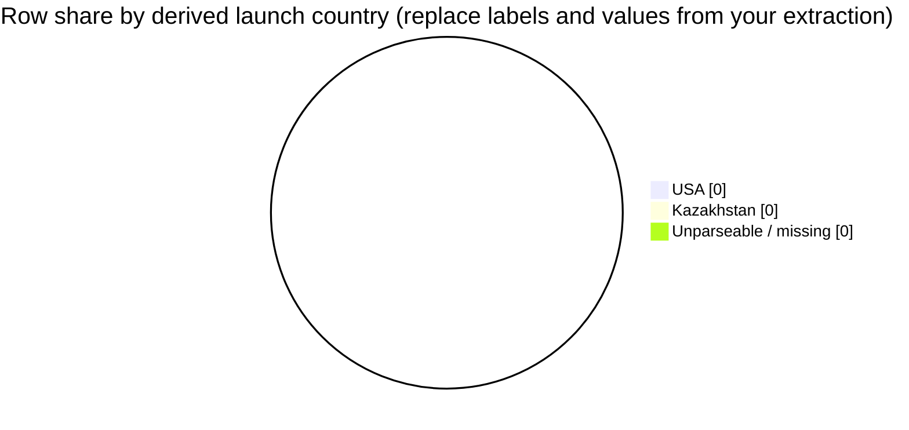

# Business question: launch country share (row percentages) from `Location` — table and pie

## Context and data

Act as a **space launch geography analyst**. Ground every number in **retrieved rows** from `dataset/space_missions.csv`, using column meanings from **`docs/applications/rag/space_missions_data_dictionary.md`**.

The dictionary defines **`Location`** as the geographic / site field (pad, cosmodrome, region as recorded). There is **no** separate `Country` column—**country labels must be derived only from the text of `Location` in the evidence you have**, using an explicit rule below.

**Scope:** All rows present in **retrieved context** unless the user-facing question below adds a filter.

## Country derivation rule (mandatory)

Apply **one** rule consistently and state it in your answer:

- **Default rule:** Treat the **country** as the **last comma-separated segment** of `Location` after trimming whitespace (for example `"…, Florida, USA"` → `USA`; `"…, Baikonur Cosmodrome, Kazakhstan"` → `Kazakhstan`).
- If `Location` is **empty**, or the last segment is **not** a plausible country token for your evidence (for example ends mid-phrase, or is clearly a site name with no country), assign **`Unparseable / missing`** and **do not** guess a country from `Company` or external knowledge.
- **Mechanical vs semantic buckets:** You may either (a) bucket the **literal last segment** for every non-empty `Location`, or (b) route ill-formed tails to **`Unparseable / missing`**. If you use (a), you **must** treat slice labels as **parser outputs** (“derived tail tokens”), not validated sovereign states, and say so in **Self-critique**.
- **Do not** normalize aliases (for example mapping regions to sovereign states) unless the same mapping is applied to **every** row in your slice and you label confidence.

## Self-critique themes (required content)

Before writing the **Self-critique** section, internally run a **support-strength and bias check** on your extraction (ReAct step 4 in this repository). The **Self-critique** bullets (max **6**) **must collectively cover** all of the following—combine points into one bullet where space is tight:

1. **Top buckets** — For the **three largest** buckets by row count, state whether each count is **directly supported** by cited `Location` examples; assign per-bucket **support strength** `High` / `Medium` / `Low` (one label per bucket, with a one-clause rationale).
2. **Semantic mismatch** — Call out at least **one** bucket whose tail is a **place type but not a country in ordinary language** (for example ocean, sea, missile range, or a **US state** appearing alone as the last segment) and explain how that affects reading percentages as “countries.”
3. **Totals / scope** — State whether bucket counts **sum** to your slice total and whether **any** rows were excluded from the denominator; if the data dictionary path was **not** present in retrieved context, say what you **cannot** verify from it.
4. **Retrieval bias** — Note whether **partial retrieval** could reorder or inflate/deflate specific country tails versus the full CSV.
5. **Chart fidelity** — Confirm the **pie** uses the **same numbers** as the table for every slice shown; if you used **`Other`**, name **rollup risk** (small buckets hidden in one slice).

## Task outcomes (numbered)

1. **Select fields** — Use at least **`Location`**, **`Mission`** (or **`Date`**) for row identity, and **`Company`** only if you explain a tie-break; justify any extra filters (max **6** bullets in the section).
2. **Data quality** — Before percentages, note empty `Location`, ambiguous last segments, or a small retrieved sample that makes shares unstable; state confidence (`High` / `Medium` / `Low`) (max **6** bullets).
3. **Extract** — From **retrieved context only**, assign each row a **country bucket** (or `Unparseable / missing`), then compute **row counts** and **percentage of rows** in the analyzed slice per bucket. Denominator = **all rows in scope** (including unparseable unless you explicitly define a smaller denominator and justify it).
4. **Self-critique** — Produce **at most 6** bullets that together satisfy **Self-critique themes (required content)** above (support strength for top 3 buckets, semantic mismatch, totals/dictionary limits, retrieval bias, chart fidelity).
5. **Revise** — Remove or soften any share not supported by the slice; if you cannot produce **positive** counts for at least **two** country buckets from evidence, **omit** the pie and explain why (still provide the table if any rows exist).
6. **Visualize** — Provide **one** Mermaid **pie** chart of the **same** counts or **percentage** shares as the table (pick **one** convention for both). Mermaid pie slices require **positive numbers**; omit buckets with **zero** count from the pie and list them in prose. If **more than 12** buckets have positive counts, the pie shows the **top 11** by row count plus one **`Other`** slice summing the rest; name which country labels roll into **`Other`**; the **Extracted table** must still list **every** bucket.

## Mermaid pie chart (syntax)

Use a fenced code block with language `mermaid`. Optional: `showData` and `title`. Slice labels must match your **derived country bucket** strings (including `Unparseable / missing` if it has a positive count).

(Replace zeros with values **computed from provided records only**, after applying the **last-segment** rule to **`Location`**. Add or remove quoted labels so every **positive-count** bucket in the pie is represented, subject to the **top 11 + Other** rule above.)

## Strict output sections

Return exactly these sections, **in order**:

- **Field selection and filters** — Bullet list (max **6** bullets); must repeat the **last-segment** country rule verbatim or quote it.
- **Data quality and confidence** — Bullet list (max **6** bullets).
- **Country assignment examples** — Bullet list (max **4** bullets): cite **up to four** distinct `Location` strings from context and the country bucket you assigned.
- **Extracted table** — Markdown table: `Country bucket`, `Row count`, `% of rows in slice` (or state “not computable”).
- **Self-critique** — Bullet list (max **6** bullets); must cover every theme in **Self-critique themes (required content)** (combine themes into fewer bullets if needed).
- **Chart** — One `mermaid` pie block or a one-line statement that the chart is omitted and why.
- **Summary** — At most **4** sentences: what the evidence shows, what the parser might miss, what remains unknown about the full CSV.

**Rules:** No fabricated row counts; no invented `Location` values; if evidence is partial, say so; do not treat this file as indexed unless it lives under the configured Rag corpus folder (**`DocumentsFolderPath`** + **`DocumentsPath`**).

## Question (user-facing)

Using only **retrieved** rows from the space missions data, and interpreting geography via **`Location`** as defined in **`docs/applications/rag/space_missions_data_dictionary.md`**, what **percentage of missions (rows)** fall under each **derived launch country** when you apply the **last comma-separated segment** rule? Return **counts and percentages in a table** and show the **same** distribution in a **single Mermaid pie chart**.
